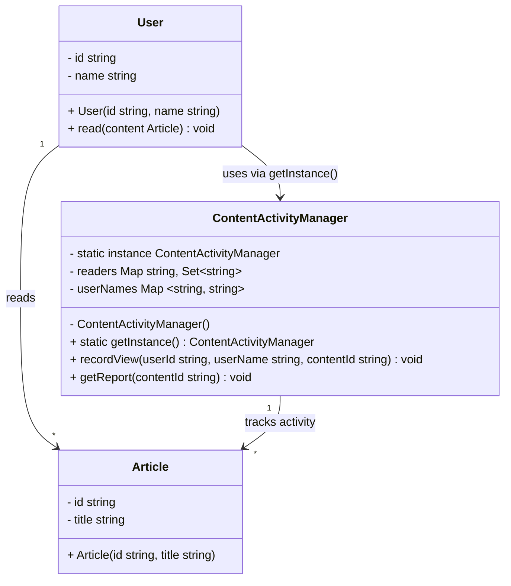

# Singleton Pattern - Class Diagram

## 📋 Pattern Overview

**Singleton** เป็น Creational Design Pattern ที่ยึดมั่นในหลักการว่าคลาสควรมี**อินสแตนซ์เพียงตัวเดียว** และมีเพียงจุดเดียวในการเข้าถึง (Global Point of Access)

**Real-world Use Case:** บันทึกกิจกรรมผู้ใช้ (Activity Logger) - รับประกันว่าทั้งระบบบันทึกไปยังแหล่งเดียวกัน ป้องกันการสร้างหลายแหล่งที่ขัดแย้งกัน

---

## 🎨 Class Diagram

---

## 🏗️ Component Mapping

### Singleton Component:
- **Singleton:** `ContentActivityManager`
  - บันทึกกิจกรรมการอ่านบทความในระบบ
  - เก็บข้อมูล: `readers` (ใครอ่านอะไร) และ `userNames` (ชื่อผู้ใช้)
  - **Private Constructor** ป้องกันการสร้างอินสแตนซ์จากภายนอก
  - **Static getInstance()** เป็นจุดเข้าถึงเพียงจุดเดียว

### Client Components:
- **User:** ผู้ใช้งาน เมื่อดำเนินการ `read()` จะเรียกใช้ Singleton
- **Article:** บทความที่ถูกอ่าน มี `id` และ `title`

---

## 🔗 Relationships

| Relationship | Description |
|---|---|
| `User → ContentActivityManager` | User ขอใช้บริการ Singleton ผ่าน `getInstance()` เพื่อบันทึกกิจกรรม |
| `User → Article` | User อ่านบทความ |
| `ContentActivityManager → Article` | Singleton ติดตามและบันทึกข้อมูลเกี่ยวกับบทความ |

---

## ✨ Key Characteristics

✅ **Single Instance:** มีเพียง 1 อินสแตนซ์ตลอดวงจรชีวิตแอปพลิเคชัน  
✅ **Global Access Point:** เข้าถึงได้ทุกที่ผ่าน `getInstance()`  
✅ **Lazy Initialization:** สร้างเมื่อจำเป็น (ไม่สร้างตั้งแต่แรม)  
✅ **Thread-Safe Pattern:** (สามารถทำให้ safe ได้ด้วยการตรวจสอบขณะมี thread หลายตัว)

