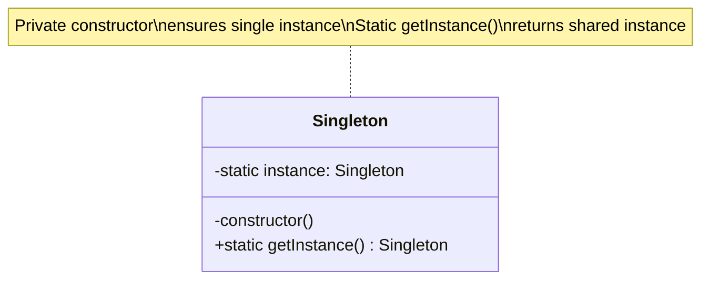

# Singleton Pattern - Class Diagram

## Description
- **Single Instance**: `Singleton` class มี private static instance ที่เก็บ object เพียงตัวเดียว
- **Private Constructor**: ป้องกันการสร้าง instance จากภายนอก
- **getInstance()**: Static method ที่คืนค่า instance เดียวกันเสมอ
