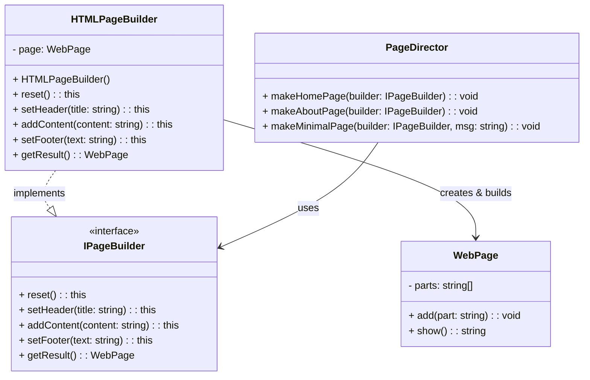

# Builder Pattern - Class Diagram

## 📋 Pattern Overview

**Builder** เป็น Creational Design Pattern ที่ใช้สำหรับ**สร้างวัตถุที่ซับซ้อนทีละส่วน** แบ่งกระบวนการสร้างออกจากการแสดงผล (Separation of Concerns) ใช้ Fluent Interface สำหรับโค้ดที่อ่านง่าย

**Real-world Use Case:** สร้างเพจ HTML - Header, Content, Footer สามารถถูกเพิ่มเข้าไปโดยการสั่ง (Sequence) ต่างๆ ได้

---

## 🎨 Class Diagram

---

## 🏗️ Component Mapping

### Product (ผลิตภัณฑ์):
- **Product:** `WebPage`
  - ชุดส่วนประกอบ: Header, Content, Footer
  - เก็บไว้ใน Array `parts`
  - วิธี `show()` แสดงผลเพจที่สร้างสำเร็จ

### Builder Interface:
- **Builder Interface:** `IPageBuilder`
  - กำหนดสัญญาเมธอดการสร้าง:
    - `reset()` - เริ่มต้นใหม่
    - `setHeader(title)` - ตั้งค่า Header
    - `addContent(content)` - เพิ่มเนื้อหา
    - `setFooter(text)` - ตั้งค่า Footer
    - `getResult()` - คืนผลลัพธ์
  - ใช้ Fluent Interface (return `this`) สำหรับ Method Chaining

### Concrete Builder:
- **Concrete Builder:** `HTMLPageBuilder`
  - มี instance variable: `page: WebPage`
  - implement แต่ละเมธอด:
    - `reset()` สร้าง WebPage ใหม่
    - `setHeader()` เพิ่ม HTML tag
    - `addContent()` เพิ่มเนื้อหาใน tag
    - `setFooter()` เพิ่ม Footer
  - `getResult()` คืน WebPage และ reset พร้อมสำหรับการสร้างครั้งต่อไป

### Director (ผู้บริหาร):
- **Director:** `PageDirector`
  - เก็บสูตรมาตรฐาน (Recipe) สำหรับการสร้างเพจต่างๆ:
    - `makeHomePage()` - สูตรเพจแรกหน้า
    - `makeAboutPage()` - สูตรเพจ About
    - `makeMinimalPage()` - สูตรเพจง่ายๆ
  - **Stateless** - ไม่เก็บ State ของ Builder เอาไว้

### Client (ผู้ใช้):
- ใช้ Builder และ Director เพื่อสร้างเพจ

---

## 🔗 Relationships

| Relationship | Description |
|---|---|
| `HTMLPageBuilder implements IPageBuilder` | Concrete Builder ทำตามสัญญา |
| `HTMLPageBuilder → WebPage` | Builder สร้างและแก้ไข Product |
| `PageDirector → IPageBuilder` | Director ใช้ Builder Interface |

---

## ✨ Key Characteristics

✅ **Step-by-Step Construction:** สร้างวัตถุเป็นขั้นตอน ไม่ต้องสร้างทั้งหมดในครั้งเดียว  
✅ **Fluent Interface:** Method Chaining ทำให้โค้ดอ่านง่าย (e.g., `builder.setHeader().addContent().setFooter()`)  
✅ **Flexible Recipes:** Director มีสูตร (Recipe) ต่างๆ สำหรับการสร้าง  
✅ **Separation of Concerns:** การสร้าง (Builder) แยกจากการประยุกต์ใช้ (Director)  
✅ **Immutability:** getResult() reset Builder พร้อมสำหรับงานต่อไป

