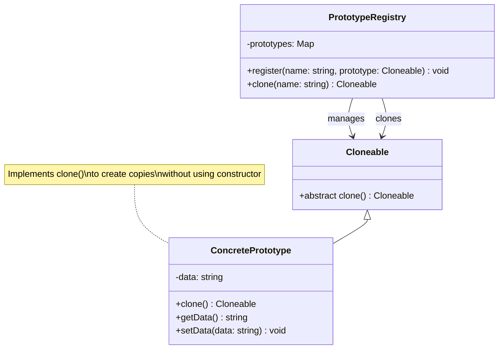

# Prototype Pattern - Class Diagram

## Description
- **Cloneable**: Interface ที่ define clone() method
- **ConcretePrototype**: Class ที่ implement clone() เพื่อสร้าง copies ของตัวเอง
- **PrototypeRegistry**: Optional class ที่จัดการและเรียกใช้ prototypes
- **clone()**: สร้าง independent copy ของ object
