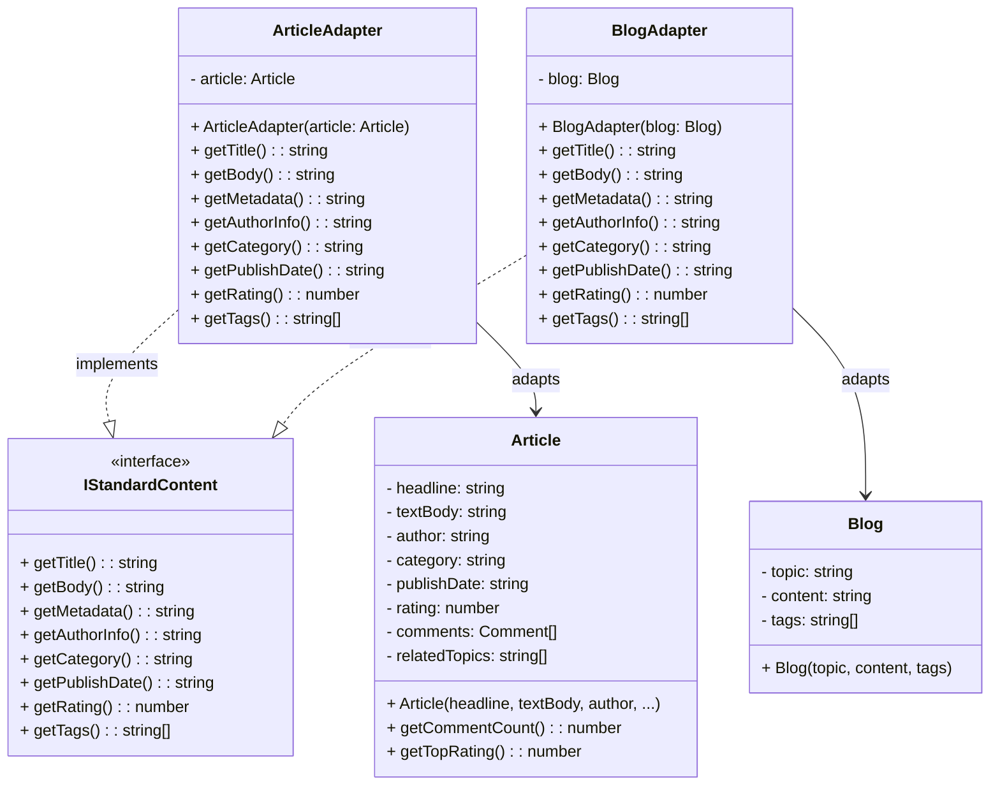

# Adapter Pattern - Class Diagram

## 📋 Pattern Overview

**Adapter** เป็น Structural Design Pattern ที่ใช้ **แปลงให้ Interface ของคลาสเดิม เข้ากันได้กับ Interface ที่ Client คาดหวัง** โดยไม่เปลี่ยนโค้ดต้นทาง เหมือนตัวแปลงปลั๊กไฟ

**Real-world Use Case:** บทความ (Article) และบล็อก (Blog) มี Interface ต่างกัน ต้องแปลงให้เป็น `IStandardContent` ร่วมกัน

---

## 🎨 Class Diagram

---

## 🏗️ Component Mapping

### Target Interface (มาตรฐานกลาง):
- **IStandardContent**
  - กำหนดวิธีการเข้าถึงข้อมูล Content ตัวใดตัวหนึ่ง
  - 8 methods: title, body, metadata, author, category, date, rating, tags

### Adaptees (ข้อมูลต้นฉบับ - Interface ไม่เข้ากัน):
- **Article**
  - มี: headline, textBody, author, category, publishDate, rating, comments, relatedTopics
  - Interface ไม่เข้ากับ IStandardContent
- **Blog**
  - มี: topic, content, tags
  - Interface ต่างกัน

### Adapters (ตัวแปลง):
- **ArticleAdapter**
  - implements `IStandardContent`
  - ถือ Article ไว้เป็น private
  - แปลง Article methods → IStandardContent interface
- **BlogAdapter**
  - implements `IStandardContent`
  - ถือ Blog ไว้เป็น private
  - แปลง Blog methods → IStandardContent interface

---

## 🔗 Relationships

| Relationship | Description |
|---|---|
| `ArticleAdapter implements IStandardContent` | Adapter implements Target Interface |
| `BlogAdapter implements IStandardContent` | Adapter implements Target Interface |
| `ArticleAdapter → Article` | Adapter "ถือ" Adaptee ที่จะแปลง |
| `BlogAdapter → Blog` | Adapter "ถือ" Adaptee ที่จะแปลง |

---

## ✨ Key Characteristics

✅ **Convert Interface:** แปลง Interface ที่ไม่เข้ากันให้เข้ากัน  
✅ **Preserve Original Classes:** ไม่ต้องแก้โค้ด Article หรือ Blog  
✅ **Reusability:** Adapter ทำให้โค้ดเดิมสามารถใช้กับ Interface ใหม่ได้  
✅ **One-to-One Mapping:** Adapter 1 ตัวแปลง Adaptee 1 ตัว

