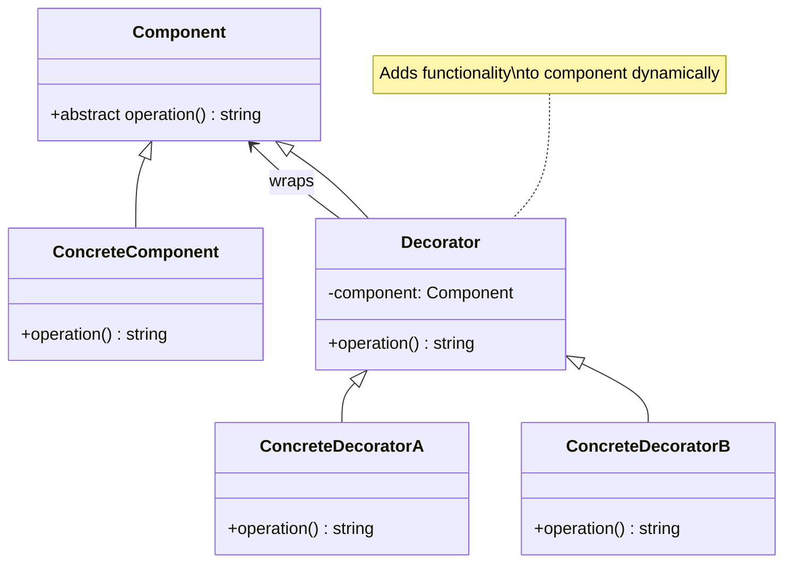

# Decorator Pattern - Class Diagram

## Description
- **Component**: Interface ของ objects ที่สามารถ decorate ได้
- **ConcreteComponent**: Object ที่จะถูก decorate
- **Decorator**: Abstract class ที่ implement component interface และ wrap component
- **ConcreteDecorators**: Classes ที่เพิ่มความสามารถให้กับ component
