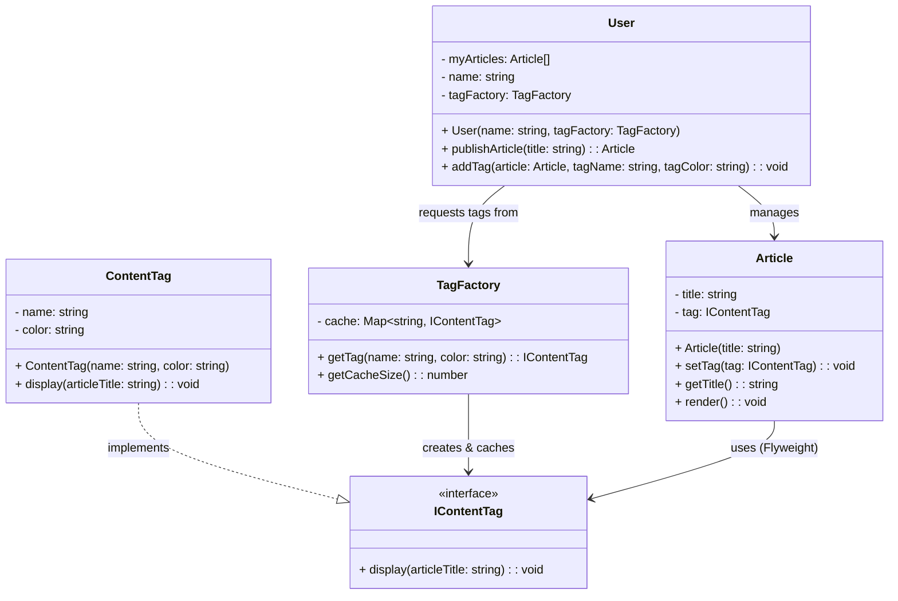

# Flyweight Pattern - Class Diagram

## 📋 Pattern Overview

**Flyweight** เป็น Structural Design Pattern ที่ **แชร์ข้อมูลร่วม (Intrinsic State) ระหว่างหลาย Objects เพื่อประหยัดหน่วยความจำ** โดยสิ่งที่แตกต่างกัน (Extrinsic State) เก็บแยก

**Real-world Use Case:** ระบบแปะ Tag บทความ - Tag "[Design]" แชร์ใช้ได้โดย 1000 บทความแต่สร้างเพียงครั้งเดียว

---

## 🎨 Class Diagram



---

## 🏗️ Component Mapping

### Flyweight Interface:
- **IContentTag**
  - `display(articleTitle)` - แสดง Tag

### Concrete Flyweight (ส่วนแชร์ใช้):
- **ContentTag**
  - implements `IContentTag`
  - **Intrinsic State (แชร์ใช้):**
    - `name: string` - "Design"
    - `color: string` - "blue"
  - ข้อมูล Intrinsic ไม่เปลี่ยนและแชร์ได้ทั้งระบบ

### Flyweight Factory (คนคุมของ):
- **TagFactory**
  - เก็บ `cache: Map<key, IContentTag>`
  - `getTag(name, color)` - ขอ Tag
    - ถ้า cache มี → return จาก cache ✅
    - ถ้าไม่มี → create ใหม่ + เก็บ cache
  - `getCacheSize()` - ดูจำนวน Flyweight

### Context (บทความ):
- **Article**
  - เก็บ `tag: IContentTag` (Flyweight)
  - **Extrinsic State (เฉพาะตัว):**
    - `title: string` - "Design Patterns 101"
  - `render()` เรียก Flyweight `display(title)`

### Client:
- **User**
  - เก็บ `tagFactory` เพื่อขอ Tag
  - `publishArticle()` สร้าง Article
  - `addTag()` ขอ Tag จาก Factory แล้วแปะ

---

## 🔗 Relationships

| Relationship | Description |
|---|---|
| `ContentTag implements IContentTag` | Concrete Flyweight |
| `TagFactory → IContentTag` | Factory สร้างและ cache Flyweight |
| `Article → IContentTag` | Article ใช้ Flyweight (ไม่เป็นเจ้าของ) |
| `TagFactory → cache` | Factory จัดเก็บ Flyweight ใน cache |
| `User → TagFactory` | Client ขอ Flyweight จาก Factory |

---

## 💡 Memory Optimization Example

```
WITHOUT Flyweight (❌ สิ้นเปลือง):
Article 1: Tag("Design", "blue") → Object A
Article 2: Tag("Design", "blue") → Object B
Article 3: Tag("Design", "blue") → Object C
Article 1000: Tag("Design", "blue") → Object Z
= 1000 objects ถึง 1000 tag ตัวเดียวกัน ❌

WITH Flyweight (✅ ประหยัด):
TagFactory.cache:
  "Design_blue" → Object X (สร้างครั้งแรก)

Article 1: ref Object X
Article 2: ref Object X
Article 3: ref Object X
Article 1000: ref Object X
= 1 object แชร์ใช้ 1000 ครั้ง ✅

Memory Saved: 99.9% ✅
```

---

## ✨ Key Characteristics

✅ **Memory Efficiency:** แชร์ข้อมูล Intrinsic ประหยัดหน่วยความจำ  
✅ **Factory Pattern:** TagFactory ควบคุมการสร้าง Flyweight  
✅ **Cache Management:** Cache เก็บ Flyweight ที่สร้างแล้ว  
✅ **Transparency:** Article ไม่รู้ว่า Tag ถูกแชร์  
✅ **Scalability:** เก็บหลาย Object ไม่เพิ่ม Memory ใช้

---

## 📊 Intrinsic vs Extrinsic State

| State Type | Data | Storage | Shareable |
|---|---|---|---|
| **Intrinsic** | name, color | ContentTag object | ✅ Yes (Shared in cache) |
| **Extrinsic** | title (article), articleId | Article object | ❌ No (Unique per article) |

