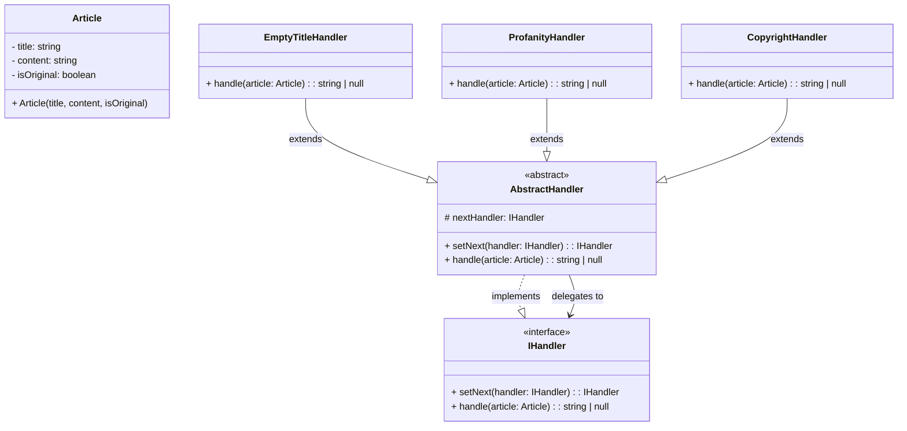

# Chain of Responsibility Pattern - Class Diagram

## 📋 Pattern Overview

**Chain of Responsibility** เป็น Behavioral Design Pattern ที่ **สร้างสายการประมวลผล (Chain) โดยส่งคำขอผ่าน Handler ตัวต่อตัว จนกว่าตัวใดตัวหนึ่งจะประมวลผลได้** ช่วยหลีกเลี่ยงการสร้าง Conditional Logic ที่ยุ่งเหยิง

**Real-world Use Case:** ระบบตรวจสอบบทความ - ตรวจสอบชื่อ → ตรวจสอบคำไม่ดี → ตรวจสอบลิขสิทธิ์ ทีละด่าน

---

## 🎨 Class Diagram



---

## 🏗️ Component Mapping

### Handler Interface:
- **IHandler**
  - `setNext(handler)` - ตั้งค่าคนถัดไป
  - `handle(article)` - ประมวลผล (return error หรือ pass ต่อ)

### Abstract Handler:
- **AbstractHandler**
  - implements `IHandler`
  - ถือ `nextHandler` ไว้
  - `setNext()` ตั้งค่า chain
  - `handle()` ส่งต่อให้คนถัดไป (if nextHandler exists)

### Concrete Handlers:
- **EmptyTitleHandler** - ตรวจสอบชื่อเว่
- **ProfanityHandler** - ตรวจสอบคำหยาบ
- **CopyrightHandler** - ตรวจสอบลิขสิทธิ์

---

## 🔗 Relationships

| Relationship | Description |
|---|---|
| `AbstractHandler implements IHandler` | Handler พื้นฐาน |
| `EmptyTitleHandler extends AbstractHandler` | Concrete Handler สำหรับขั้นแรก |
| `ProfanityHandler extends AbstractHandler` | Concrete Handler สำหรับขั้นที่ 2 |
| `CopyrightHandler extends AbstractHandler` | Concrete Handler สำหรับขั้นที่ 3 |
| `AbstractHandler → IHandler` | Handler ส่งต่อให้คนถัดไป |

---

## 💡 Chain Workflow

```
EmptyTitleHandler
    ↓ (pass ✓)
ProfanityHandler
    ↓ (pass ✓ or error ✗)
CopyrightHandler
    ↓
Return null (Success) or Error Message
```

---

## ✨ Key Characteristics

✅ **Decoupled Handlers:** แต่ละ Handler ไม่รู้จัก Handler อื่น  
✅ **Dynamic Chain:** สร้าง Chain ได้ตลอดเวลา (Runtime)  
✅ **Easy to Add:** เพิ่ม Handler ใหม่โดยไม่แก้เก่า  
✅ **Single Responsibility:** Handler แต่ละตัวรับผิดชอบขั้นเดียว

