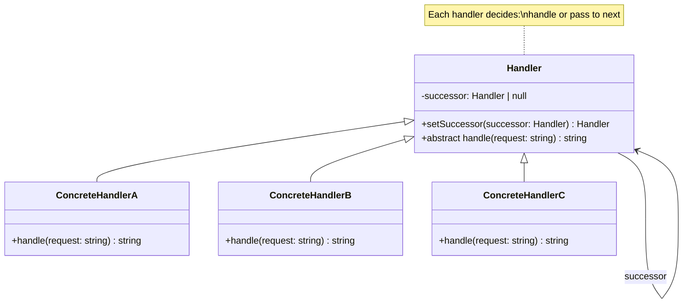

# Chain of Responsibility Pattern - Class Diagram

## Description
- **Handler**: Abstract class ที่ define handling method และ successor
- **ConcreteHandlers**: Classes ที่ handle request หรือส่งต่อให้ successor
- Handlers สร้าง chain ที่ requests ส่งผ่าน
- ถ้า handler ไม่สามารถจัดการได้ มันจะส่งให้ successor
