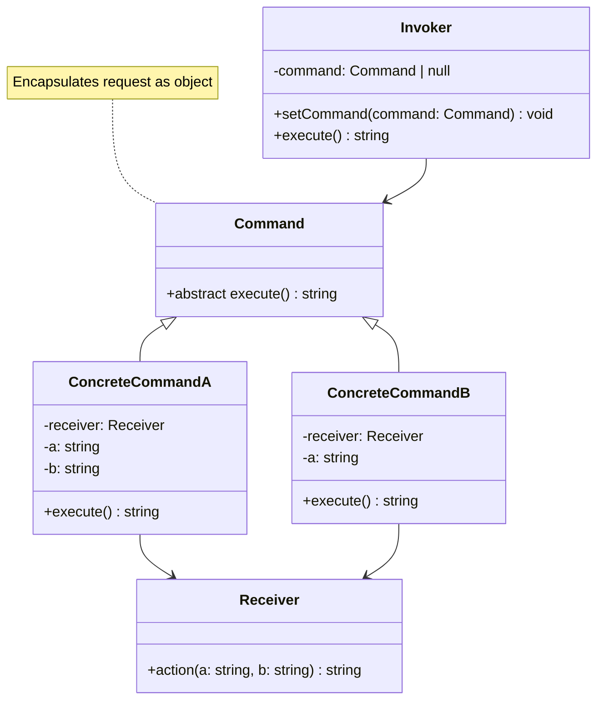

# Command Pattern - Class Diagram

## Description
- **Command**: Interface ที่ define execute method
- **ConcreteCommands**: Encapsulate requests ด้วย receiver references
- **Receiver**: Object ที่ทำงาน
- **Invoker**: Class ที่เรียก commands
- Supports undo/redo, queuing, logging operations
