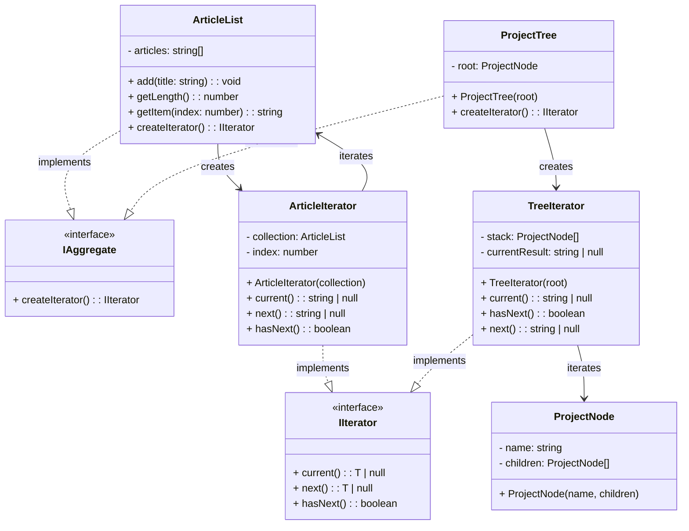

# Iterator Pattern - Class Diagram

## 📋 Pattern Overview

**Iterator** เป็น Behavioral Design Pattern ที่ **ให้วิธีการ Access Elements ของ Collection ตัวต่อตัวโดยไม่เปิดเผย Internal Structure** ซ่อนความซับซ้อนของการวนลูป

**Real-world Use Case:** วนลูป Article Array (ง่าย) และ ProjectTree (ซับซ้อน) ด้วย Interface เดียวกัน

---

## 🎨 Class Diagram



---

## 🏗️ Component Mapping

### Iterator Interface:
- **IIterator<T>**
  - `current()` - ดูตัวปัจจุบัน
  - `next()` - ขยับไปตัวถัดไป
  - `hasNext()` - เช็คว่าหมดไหม

### Aggregate Interface:
- **IAggregate**
  - `createIterator()` - สร้าง Iterator

### Concrete Collections:
- **ArticleList** (Array)
  - implements `IAggregate`
  - เก็บ: `articles: string[]`
  - `createIterator()` คืน `ArticleIterator`
- **ProjectTree** (Tree)
  - implements `IAggregate`
  - เก็บ: `root: ProjectNode`
  - `createIterator()` คืน `TreeIterator`

### Concrete Iterators:
- **ArticleIterator**
  - implements `IIterator<string>`
  - เก็บ: `collection`, `index`
  - ง่ายๆ increment index
- **TreeIterator**
  - implements `IIterator<string>`
  - เก็บ: `stack` (DFS traversal)
  - ซับซ้อน: ใช้ Stack หา "ตัวถัดไป"

---

## 🔗 Relationships

| Relationship | Description |
|---|---|
| `ArticleList implements IAggregate` | Concrete Collection (Array) |
| `ProjectTree implements IAggregate` | Concrete Collection (Tree) |
| `ArticleIterator implements IIterator` | Concrete Iterator สำหรับ Array |
| `TreeIterator implements IIterator` | Concrete Iterator สำหรับ Tree |
| `ArticleList → ArticleIterator` | Collection สร้าง Iterator |
| `ProjectTree → TreeIterator` | Collection สร้าง Iterator |

---

## 💡 Usage Pattern

```typescript
// Collection สร้าง Iterator เอง
const iter = articleList.createIterator();

// Client ใช้ Iterator แบบเดียวกัน
while (iter.hasNext()) {
    const item = iter.next();
    console.log(item);
}

// ซ่อนรายละเอียด:
// - ArticleList: increment index ง่ายๆ
// - ProjectTree: DFS stack algorithm
```

---

## ✨ Key Characteristics

✅ **Encapsulation:** ซ่อน Internal Structure จาก Client  
✅ **Multiple Iterators:** สร้าง Iterator หลายตัวได้  
✅ **Uniform Interface:** Array และ Tree ใช้ Interface เดียว  
✅ **Algorithm Flexibility:** เปลี่ยน Algorithm ได้โดยสร้าง Iterator ใหม่  
✅ **Separation of Concerns:** Logic วนลูปแยกออกจาก Collection

