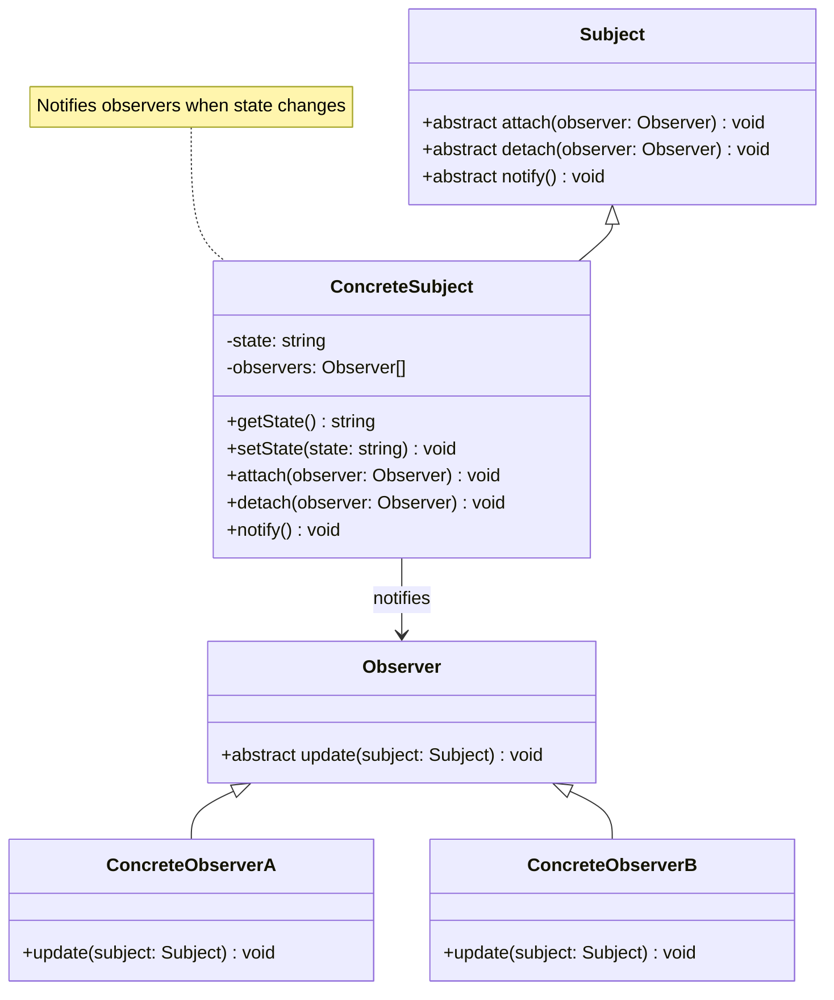

# Observer Pattern - Class Diagram

## Description
- **Observer**: Interface ที่ define update method
- **ConcreteObservers**: Implement observer interface
- **Subject**: Interface ที่ manage observers
- **ConcreteSubject**: Maintain state และ notify observers when it changes
- Loose coupling between subject และ observers
