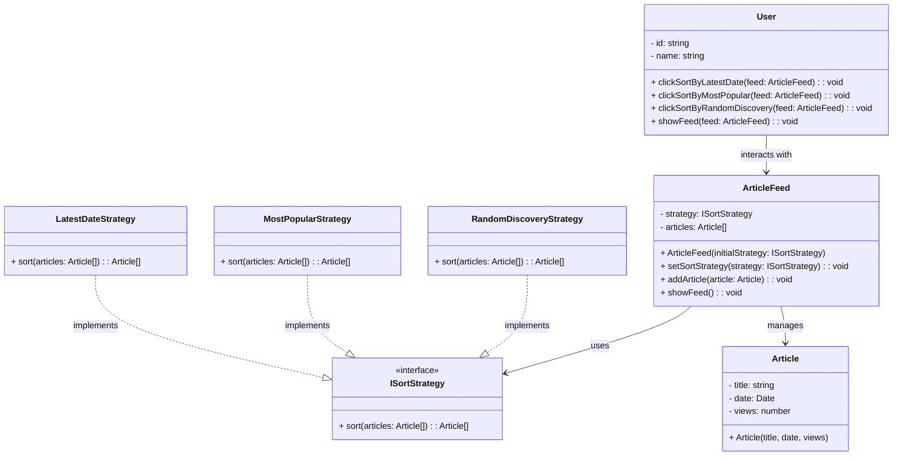

# Strategy Pattern - Class Diagram

## 📋 Pattern Overview

**Strategy** เป็น Behavioral Design Pattern ที่ **กำหนด Families ของ Algorithms เปลี่ยนแปลงได้ตลอดเวลา** ส่งให้ Client เลือก Algorithm ได้ Runtime ไม่ต้องเปลี่ยน Source Code

**Real-world Use Case:** Feed บทความสามารถเรียงลำดับแบบ Recent, Popular, หรือ Random โดยไม่สร้างโค้ดใหม่

---

## 🎨 Class Diagram



---

## 🏗️ Component Mapping

### Strategy Interface:
- **ISortStrategy**
  - `sort(articles)` - เรียงลำดับ

### Concrete Strategies:
- **LatestDateStrategy**
  - เรียงตามวันที่ (Newest first)
- **MostPopularStrategy**
  - เรียงตามยอดวิว (Most views first)
- **RandomDiscoveryStrategy**
  - เรียงสุ่ม (Discovery mode)

### Context (ผู้ใช้งาน):
- **ArticleFeed**
  - ถือ `strategy: ISortStrategy` (Composition)
  - `setSortStrategy()` เปลี่ยน Algorithm ได้ Runtime
  - `showFeed()` ใช้ strategy ปัจจุบัน

### Client:
- **User** เรียก `setSortStrategy()` เมื่อกดปุ่มเรียงลำดับ

---

## 🔗 Relationships

| Relationship | Description |
|---|---|
| `LatestDateStrategy implements ISortStrategy` | Concrete Strategy |
| `MostPopularStrategy implements ISortStrategy` | Concrete Strategy |
| `RandomDiscoveryStrategy implements ISortStrategy` | Concrete Strategy |
| `ArticleFeed → ISortStrategy` | Context ใช้ Strategy |

---

## 💡 Strategy Switching Flow

```
User clicks "Sort by Latest"
    ↓
ArticleFeed.setSortStrategy(new LatestDateStrategy())
    ↓
User clicks "Show Feed"
    ↓
ArticleFeed.showFeed()
    ├─ sorted = strategy.sort(articles)
    │   └─ LatestDateStrategy sorts by date
    └─ Display sorted articles

---

User clicks "Sort by Popular"
    ↓
ArticleFeed.setSortStrategy(new MostPopularStrategy())
    ↓ (เปลี่ยน Strategy แล้ว)

User clicks "Show Feed"
    ├─ sorted = strategy.sort(articles)
    │   └─ MostPopularStrategy sorts by views
    └─ Display sorted articles
```

---

## ✨ Key Characteristics

✅ **Runtime Selection:** เปลี่ยน Algorithm ได้ตลอดเวลา  
✅ **Encapsulation:** Algorithm ห่อไว้ใน Class  
✅ **Loose Coupling:** Context ไม่รู้รายละเอียด Algorithm  
✅ **Easy Extension:** เพิ่ม Strategy ใหม่ไม่ต้องแก้เก่า  
✅ **No If-Else:** หลีกเลี่ยง Long Conditional Logic

