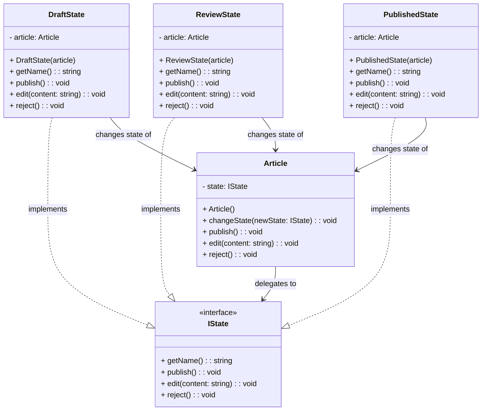

# State Pattern - Class Diagram

## 📋 Pattern Overview

**State** เป็น Behavioral Design Pattern ที่ **อนุญาตให้วัตถุเปลี่ยน Behavior เมื่อ Internal State เปลี่ยน** ดูเหมือนว่า Class เปลี่ยนไปแต่จริงๆ คือ Delegation ไปให้ State object

**Real-world Use Case:** บทความมี 3 states (Draft → Review → Published) โดยแต่ละ state มี rules ต่างกัน

---

## 🎨 Class Diagram



---

## 🏗️ Component Mapping

### State Interface:
- **IState**
  - `getName()` - ชื่อสถานะ
  - `publish()` - สั่ง publish
  - `edit(content)` - แก้ไข
  - `reject()` - ปฏิเสธ

### Context (ตัวเอก):
- **Article**
  - ถือ `state: IState` ปัจจุบัน
  - `changeState()` เปลี่ยน state
  - `publish()`, `edit()`, `reject()` - Delegation ให้ state

### Concrete States:
- **DraftState**
  - `publish()` → เปลี่ยนเป็น ReviewState ✓
  - `edit()` → บันทึกเข้า Draft ✓
  - `reject()` → Error ❌
- **ReviewState**
  - `publish()` → เปลี่ยนเป็น PublishedState ✓
  - `edit()` → Error (Locked) ❌
  - `reject()` → เปลี่ยนเป็น DraftState ✓
- **PublishedState**
  - `publish()` → Error (Already published) ❌
  - `edit()` → Error (Locked) ❌
  - `reject()` → ✓ (Unpublish)

---

## 🔗 Relationships

| Relationship | Description |
|---|---|
| `DraftState implements IState` | Concrete State |
| `ReviewState implements IState` | Concrete State |
| `PublishedState implements IState` | Concrete State |
| `Article → IState` | Context ถือ State |
| `DraftState/ReviewState/PublishedState → Article` | State เปลี่ยน Context's state |

---

## 💡 State Transition Diagram

```
┌──────────┐
│ DRAFT    │
│ • publish() ✓
│ • edit() ✓
│ • reject() ✗
└────┬─────┘
     │ publish()
     ↓
┌──────────────┐
│ UNDER REVIEW │
│ • publish() ✓ → Published
│ • edit() ✗
│ • reject() ✓ → Draft
└────┬─────────┘
     │ publish()
     ↓
┌──────────────┐
│ PUBLISHED    │
│ • publish() ✗
│ • edit() ✗
│ • reject() ✓
└──────────────┘
```

---

## ✨ Key Characteristics

✅ **State-Dependent Behavior:** แต่ละ state มี behavior ต่างกัน  
✅ **Encapsulation:** Logic ของ state ห่อไว้ใน Class  
✅ **Easy State Transitions:** State เปลี่ยนได้ง่าย  
✅ **Eliminate Long If-Else:** ไม่ต้อง if (state == "Draft") ซ้ำๆ  
✅ **Open-Closed Principle:** เพิ่ม State ใหม่ไม่ต้องแก้เก่า

