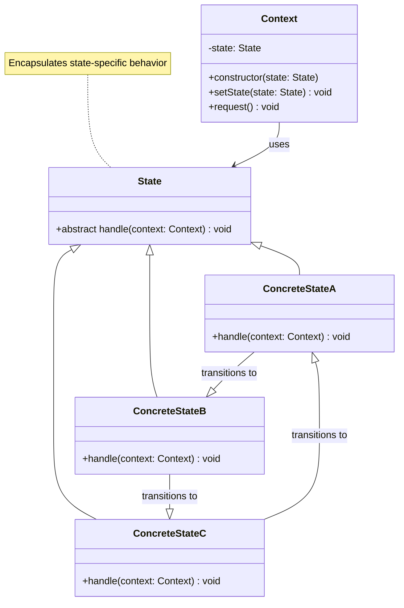

# State Pattern - Class Diagram

## Description
- **State**: Interface ที่ define state operations
- **ConcreteStates**: Implement different states
- **Context**: Use state object และ delegate work ไปยัง state
- State transitions ถูกสำหรับแต่ละ concrete state
