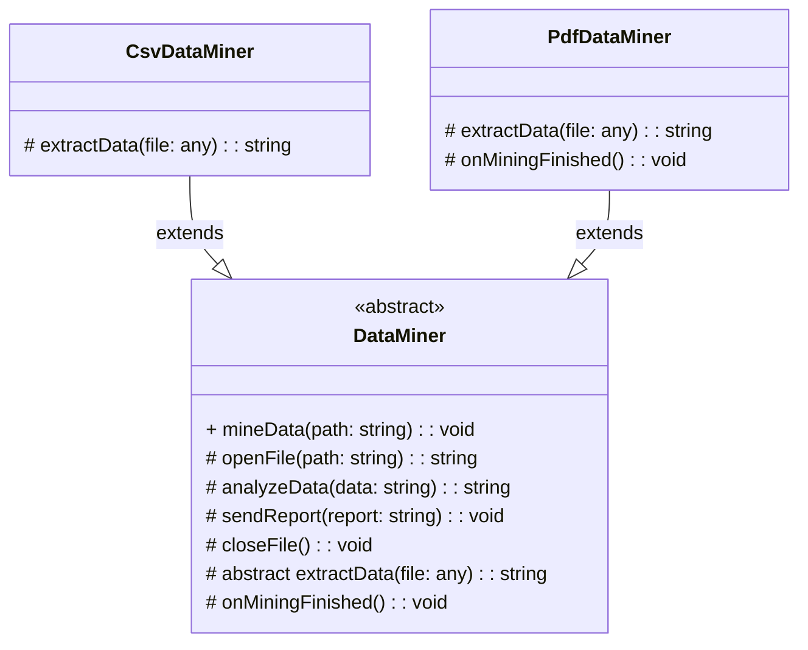

# Template Method Pattern - Class Diagram

## 📋 Pattern Overview

**Template Method** เป็น Behavioral Design Pattern ที่ **กำหนด Skeleton ของ Algorithm ใน Base Class แล้วให้ Subclass override ส่วนเฉพาะ** ไม่ต้องเขียน Algorithm ทั้งหมดใหม่

**Real-world Use Case:** ดึงข้อมูล CSV/PDF - ขั้นตอนเหมือนกัน (เปิด → แยก → วิเคราะห์ → ปิด) แต่ "แยก" data ต่างกัน

---

## 🎨 Class Diagram



---

## 🏗️ Component Mapping

### Abstract Base Class:
- **DataMiner**
  - **Template Method:** `mineData()`
    - กำหนด Skeleton: openFile → extractData → analyzeData → sendReport → onMiningFinished → closeFile
  - **Concrete Methods** (เหมือนกันหมด):
    - `openFile()` - เปิดไฟล์
    - `analyzeData()` - วิเคราะห์ (standard logic)
    - `sendReport()` - ส่งรายงาน
    - `closeFile()` - ปิดไฟล์
  - **Abstract Methods** (ต้องให้ลูก implement):
    - `extractData()` - แยก data (ต่างกันแต่ละประเภท)
  - **Hooks** (Optional):
    - `onMiningFinished()` - default ว่างเปล่า ลูกสามารถ override

### Concrete Subclasses:
- **CsvDataMiner**
  - extends `DataMiner`
  - implement `extractData()` - split by commas
  - ไม่ override Hook → ใช้แบบเริ่มต้น
- **PdfDataMiner**
  - extends `DataMiner`
  - implement `extractData()` - OCR text
  - override `onMiningFinished()` - alert user

---

## 🔗 Relationships

| Relationship | Description |
|---|---|
| `CsvDataMiner extends DataMiner` | Subclass extends Base |
| `PdfDataMiner extends DataMiner` | Subclass extends Base |

---

## 💡 Algorithm Skeleton in Base Class

```
mineData(path) {
    // Template Method - skeleton:
    ├─ rawData = openFile(path)        // Concrete (Base)
    ├─ cleanData = extractData(rawData) // Abstract (Subclass)
    ├─ analysis = analyzeData(cleanData)// Concrete (Base)
    ├─ sendReport(analysis)             // Concrete (Base)
    ├─ onMiningFinished()               // Hook (Subclass optional)
    └─ closeFile()                      // Concrete (Base)
}
```

CSV: extractData splits by commas  
PDF: extractData uses OCR  

---

## ✨ Key Characteristics

✅ **Skeleton Reuse:** Template Method เขียนครั้งเดียว  
✅ **Subclass Focus:** Subclass คิดแค่ส่วนต่างกัน  
✅ **Consistent Algorithm:** ลำดับขั้นตอนไม่เปลี่ยน  
✅ **Hooks:** optional override points เพิ่มความยืดหยุ่น  
✅ **Code Reuse:** ลดการ duplicate code

