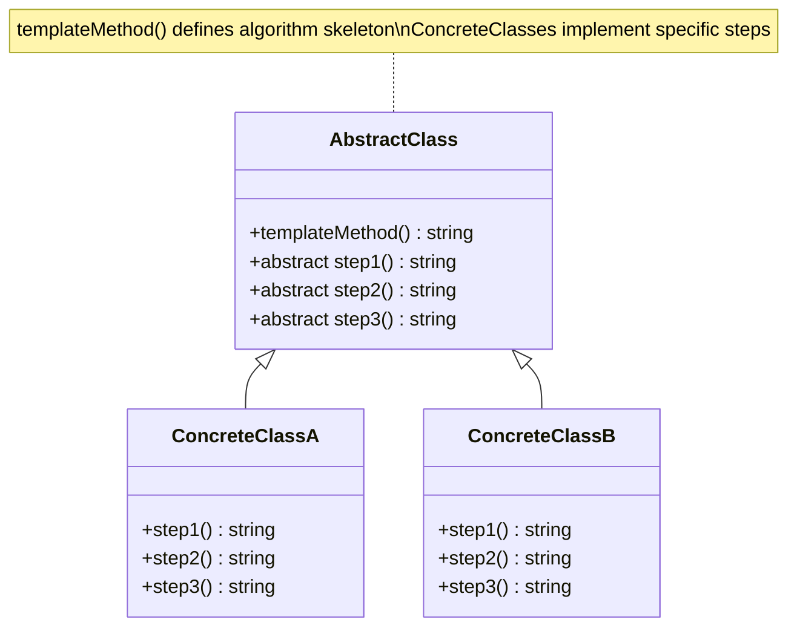

# Template Method Pattern - Class Diagram

## Description
- **AbstractClass**: Define template method ที่ define algorithm skeleton
- **Concrete Classes**: Implement abstract methods ที่ override specific steps
- Template method ควบคุมลำดับขั้นตอน
- Subclasses เติมรายละเอียด โดยไม่เปลี่ยน algorithm structure
