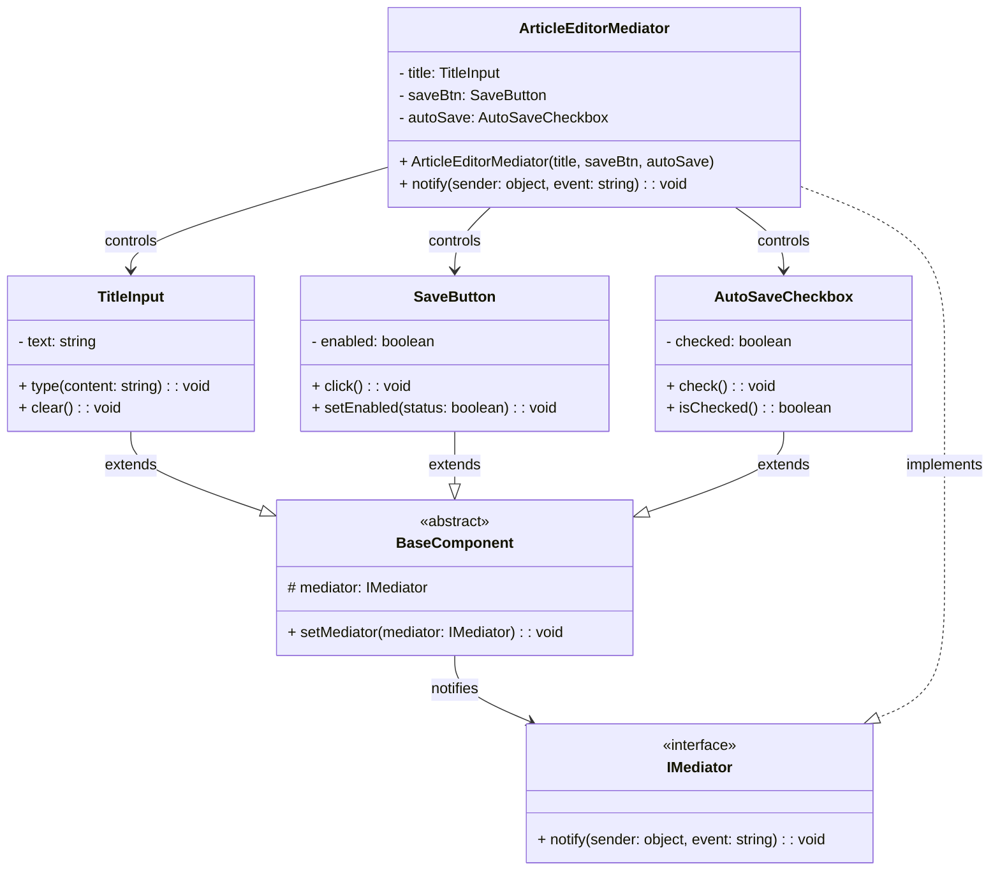

# Mediator Pattern - Class Diagram

## 📋 Pattern Overview

**Mediator** เป็น Behavioral Design Pattern ที่ **กำจัดการเชื่อมต่อ Direct ระหว่าง Objects โดยให้ทุกคน ติดต่อผ่าน Mediator ตัวกลาง** ลดความซับซ้อนของการทำงานร่วมกัน

**Real-world Use Case:** Form Editor (Title Input, Save Button, AutoSave Checkbox) - ควบคุมการเปิด/ปิดปุ่มตามเงื่อนไข

---

## 🎨 Class Diagram



---

## 🏗️ Component Mapping

### Mediator Interface:
- **IMediator**
  - `notify(sender, event)` - รับการแจ้งเตือนจาก Component

### Base Component (Colleague):
- **BaseComponent**
  - ถือ `mediator` reference
  - `setMediator()` ลงทะเบียน

### Concrete Components:
- **TitleInput**
  - extends BaseComponent
  - `type()` → notify mediator "keypress"
  - `clear()` → notify mediator "clear"
- **SaveButton**
  - extends BaseComponent
  - `click()` → notify mediator "click"
  - `setEnabled()` → state เปลี่ยน
- **AutoSaveCheckbox**
  - extends BaseComponent
  - `check()` → notify mediator "check"
  - `isChecked()` → return state

### Concrete Mediator:
- **ArticleEditorMediator**
  - implements `IMediator`
  - ถือ reference ของ Component ทั้งหมด
  - `notify()` ประสานงาน Logic ทั้งหมด:
    - TitleInput.keypress → ถ้า text > 0 เปิด SaveButton
    - AutoSaveCheckbox.check → ถ้า checked ปิด SaveButton
    - SaveButton.click → save data

---

## 🔗 Relationships

| Relationship | Description |
|---|---|
| `TitleInput extends BaseComponent` | Colleague |
| `SaveButton extends BaseComponent` | Colleague |
| `AutoSaveCheckbox extends BaseComponent` | Colleague |
| `BaseComponent → IMediator` | Colleague รู้จัก Mediator |
| `ArticleEditorMediator implements IMediator` | Concrete Mediator |
| `ArticleEditorMediator → TitleInput/SaveButton/...` | Mediator ควบคุม Colleagues |

---

## 💡 Mediator Workflow

```
User types title
    ↓
TitleInput.type()
    ↓
notify(this, "keypress")
    ↓
ArticleEditorMediator.notify(sender, "keypress")
    ├─ if (title.text.length > 0)
    └─ saveBtn.setEnabled(true)

---

User checks AutoSave
    ↓
AutoSaveCheckbox.check()
    ↓
notify(this, "check")
    ↓
ArticleEditorMediator.notify(sender, "check")
    ├─ if (autoSave.isChecked())
    └─ saveBtn.setEnabled(false)
```

---

## ✨ Key Characteristics

✅ **Centralized Logic:** ทุก logic อยู่ใน Mediator เดียว  
✅ **Decoupled Components:** Component ไม่รู้จัก Component อื่น  
✅ **Reduced Coupling:** Many-to-Many → Through Mediator  
✅ **Easy to Maintain:** เปลี่ยน Logic ที่ Mediator เดียว  
✅ **Reusability:** Component เดียวใช้กับ Mediator ต่างได้

