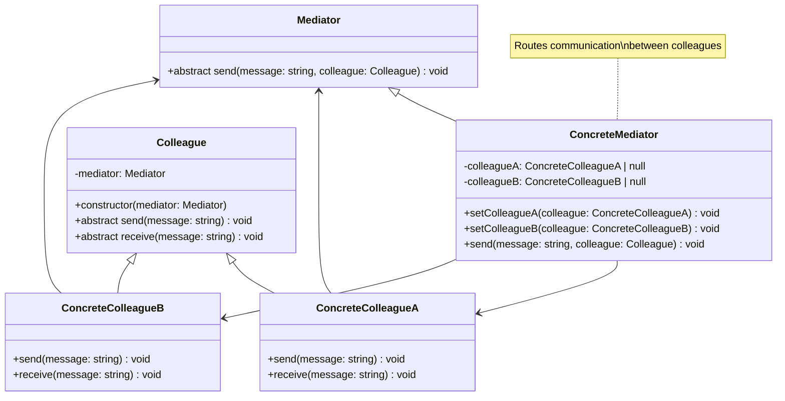

# Mediator Pattern - Class Diagram

## Description
- **Mediator**: Interface ที่ define communication methods
- **ConcreteMediator**: Implement mediator logic ที่ route communications
- **Colleague**: Base class ของ objects ที่ interact
- **ConcreteColleagues**: Implement colleague interface
- Colleagues communicate ผ่าน mediator แทนที่จะ directly
