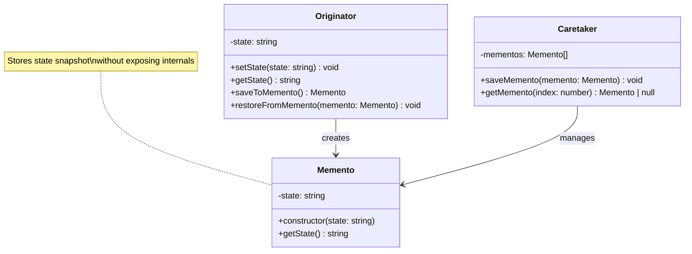

# Memento Pattern - Class Diagram

## Description
- **Memento**: Stores snapshot ของ originator state
- **Originator**: Creates memento และ restore state จาก memento
- **Caretaker**: Manages collection ของ mementos
- Memento encapsulates state โดยไม่ให้ client เข้าถึง internals
- Supports undo/redo functionality
