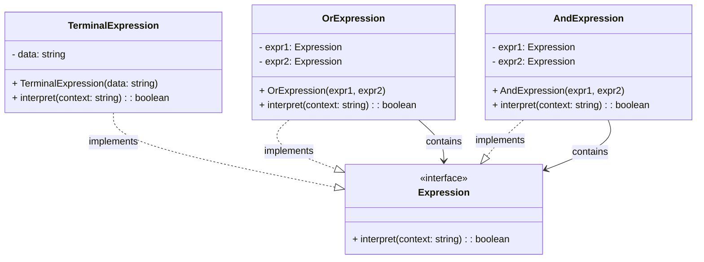

# Interpreter Pattern - Class Diagram

## 📋 Pattern Overview

**Interpreter** เป็น Behavioral Design Pattern ที่ **กำหนด Representation ของ Grammar และสร้าง Interpreter ที่แปลโปรแกรม** ใช้เมื่อต้อง Parse หรือ Interpret Custom Language/Notation

**Real-world Use Case:** การตรวจสอบข้อความ - ใช้ Grammar: "(A OR B) AND C" เพื่อค้นหาข้อความ

---

## 🎨 Class Diagram



---

## 🏗️ Component Mapping

### Expression Interface:
- **Expression**
  - `interpret(context)` - แปล context

### Terminal Expressions (Leaf - ตัวจบ):
- **TerminalExpression**
  - เก็บ `data` (ข้อมูลดิบ)
  - `interpret()` - เช็ค context มี data นี้ไหม

### Non-Terminal Expressions (Composite - สัญลักษณ์ประกอบ):
- **OrExpression**
  - ถือ `expr1`, `expr2`
  - `interpret()` - return `expr1 OR expr2`
- **AndExpression**
  - ถือ `expr1`, `expr2`
  - `interpret()` - return `expr1 AND expr2`

---

## 🔗 Relationships

| Relationship | Description |
|---|---|
| `TerminalExpression implements Expression` | Terminal implements interface |
| `OrExpression implements Expression` | Non-Terminal implements interface |
| `AndExpression implements Expression` | Non-Terminal implements interface |
| `OrExpression → Expression` | Composite contains Expressions |
| `AndExpression → Expression` | Composite contains Expressions |

---

## 💡 Grammar Tree Construction

```
Grammar: (A OR B) AND C

               AND
              /   \
            OR     C
           /  \
          A    B

Interpretation of "AC":
    AND.interpret("AC")
    ├─ OR.interpret("AC")   → A found? YES
    └─ C.interpret("AC")    → C found? YES
    Result: true

Interpretation of "BD":
    AND.interpret("BD")
    ├─ OR.interpret("BD")   → B found? YES, D not found
    └─ C.interpret("BD")    → C found? NO
    Result: false
```

---

## ✨ Key Characteristics

✅ **Grammar Definition:** กำหนด Grammar ในโค้ด  
✅ **Recursive Structure:** Expression ซ้อนใน Expression  
✅ **Easy to Extend:** เพิ่ม Expression ชนิดใหม่ได้  
✅ **Interpreter Logic:** ห่อ Logic ใน Expression  
✅ **Abstract Syntax Tree:** สร้าง AST ได้จาก grammar rules

