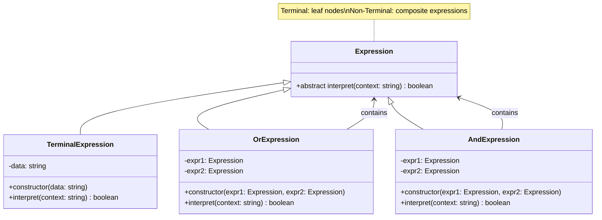

# Interpreter Pattern - Class Diagram

## Description
- **Expression**: Interface ที่ define interpret method
- **TerminalExpression**: Implement interpret สำหรับ terminal symbols
- **Non-TerminalExpressions**: Implement interpret สำหรับ grammar rules (OR, AND)
- Builds expression tree ที่ represent grammar
- Client interprets sentences ผ่าน expression tree
