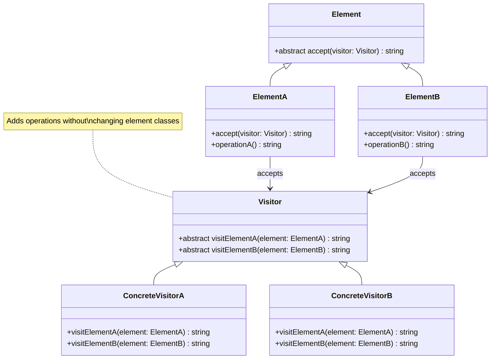

# Visitor Pattern - Class Diagram

## Description
- **Element**: Interface ที่ define accept method
- **ConcreteElements**: Implement element interface
- **Visitor**: Interface ที่ define visit methods สำหรับแต่ละ element type
- **ConcreteVisitors**: Implement specific operations
- Elements accept visitors และ call appropriate visit method
- New operations ได้จาก visitor implementations โดยไม่แก้ elements
