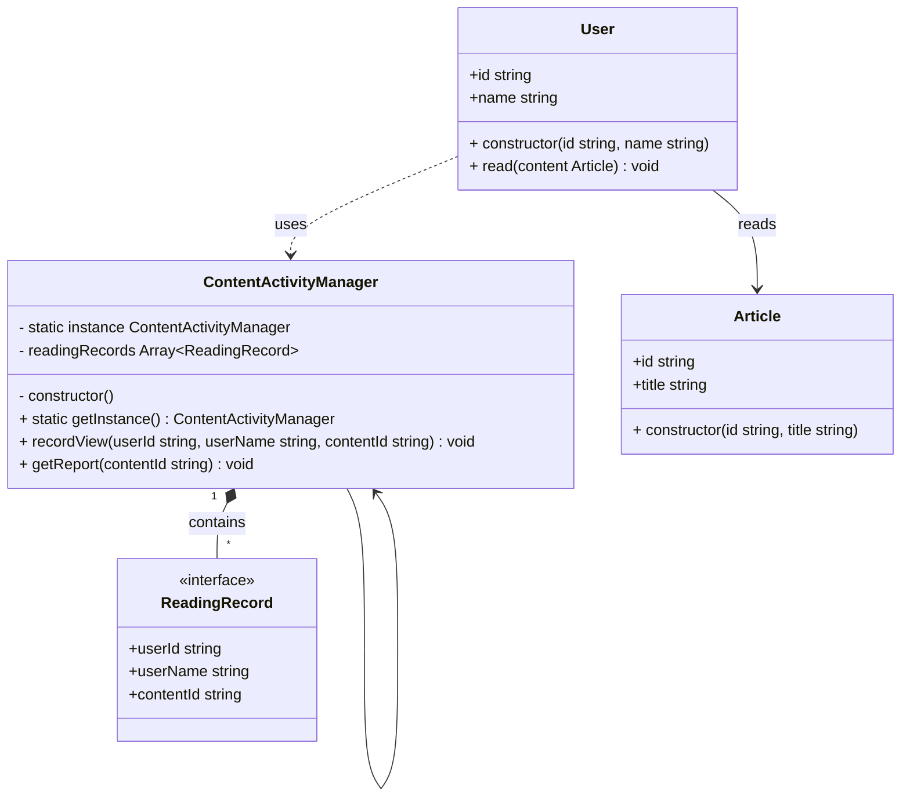
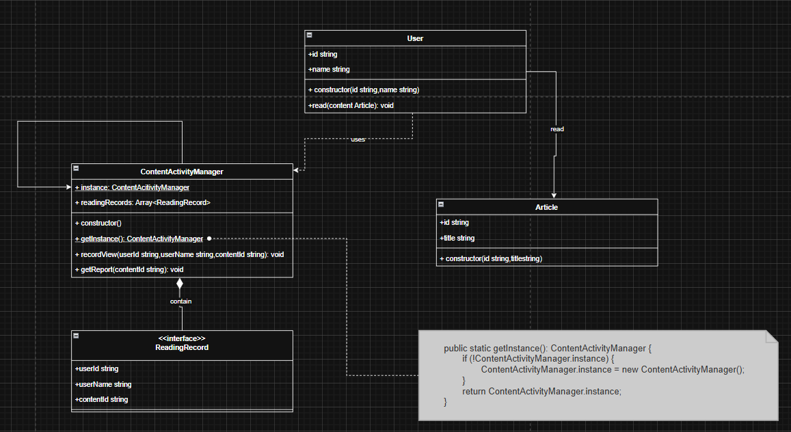

## Singleton Component
- Client:User
- Singleton:ContentActivityManager
- Product:Article

```ts
    public static getInstance(): ContentActivityManager {
        if (!ContentActivityManager.instance) {
            ContentActivityManager.instance = new ContentActivityManager();
        }
        return ContentActivityManager.instance;
    }
    public recordView(userId: string, userName: string, contentId: string): void {
        this.readingRecords.push({
            userId,
            userName,
            contentId
        });
        console.log(`   📝 ${userName} read content '${contentId}'`);
    }
    public getReport(contentId: string): void {
        // filter records by contentId
        const records = this.readingRecords.filter(r => r.contentId === contentId);
        if (records.length === 0) {
            console.log(`\n📊 No readers yet`);
            return;
        }
        const totalReads = records.length;
        const uniqueUserIds = new Set(records.map(r => r.userId));
        const uniqueCount = uniqueUserIds.size;
        const names = Array.from(uniqueUserIds).map(userId =>
            records.find(r => r.userId === userId)?.userName
        );
        console.log(`\n📊 Report for '${contentId}':`);
        console.log(`   - Total Reads: ${totalReads}`);
        console.log(`   - Unique Readers: ${uniqueCount}`);
        console.log(`   - Who: ${names.join(", ")}`);
    }
```


