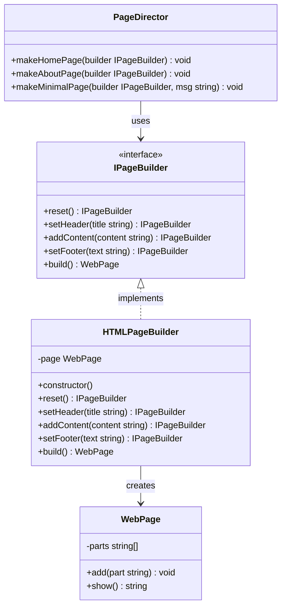

## Builder Component
- Builder: IPageBuilder
- Concrete Builder: HTMLPageBuilder
- Product: WebPage
- Director: PageDirector

```ts

```
## Planning in the Future
- Scale เพิม concrete builders (e.g., MarkdownPageBuilder, PDFPageBuilder)
- เพิ่ม features ใน WebPage (e.g., CSS styling, JavaScript integration)