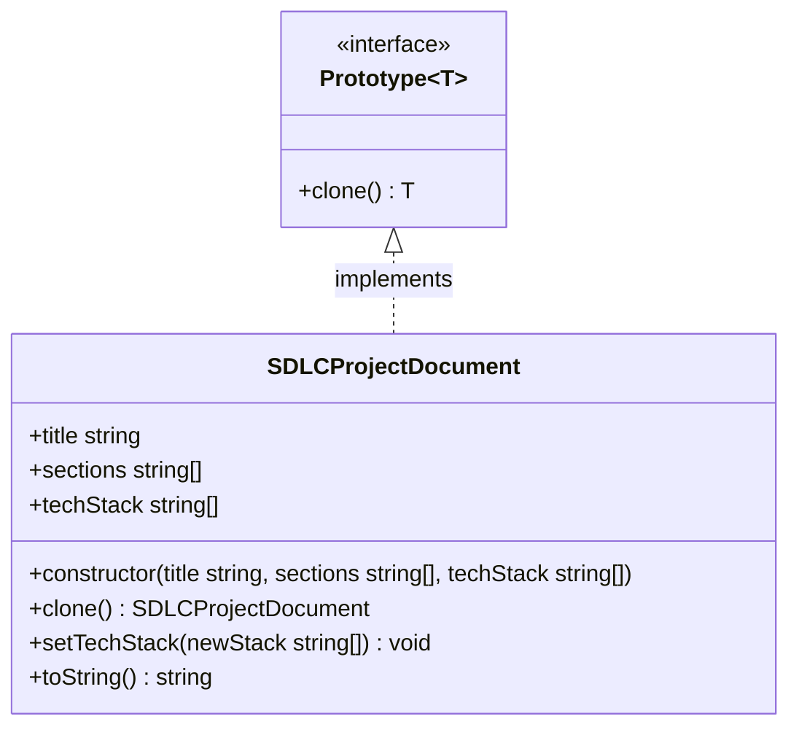

```mermaid
classDiagram
    class Prototype~T~ {
        <<interface>>
        +clone() T
    }
    
    class SDLCProjectDocument {
        +title string
        +sections string[]
        +techStack string[]
        +constructor(title string, sections string[], techStack string[])
        +clone() SDLCProjectDocument
        +setTechStack(newStack string[]) void
        +toString() string
    }
    
    Prototype~T~ <|.. SDLCProjectDocument : implements
```