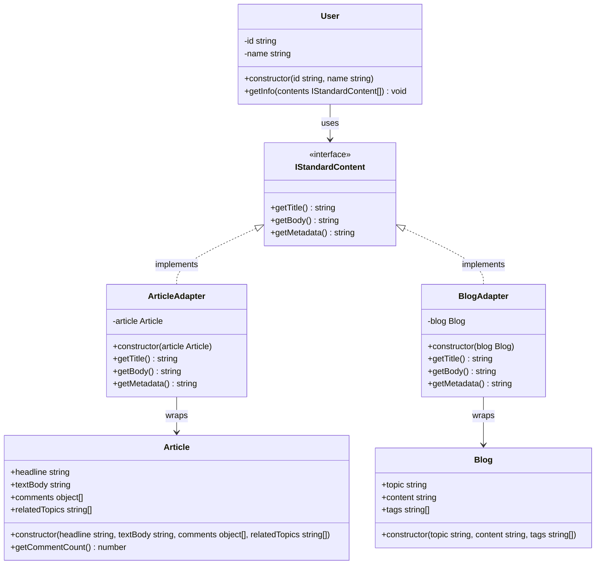
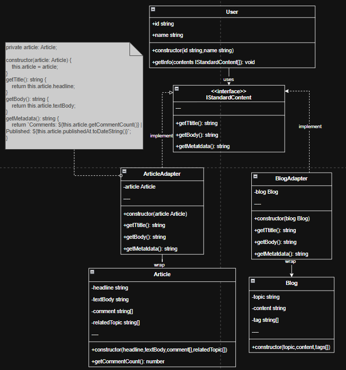

## Part of code is crucial

```ts
    private article: Article;
    
    constructor(article: Article) {
        this.article = article;
    }
    getTitle(): string {
        return this.article.headline;
    }

    getBody(): string {
        return this.article.textBody;
    }

    getAuthor(): string {
        return this.article.author;
    }

    getSummary(): string {
        return this.article.textBody.slice(0, 80).trim() + "...";
    }

    getTags(): string[] {
        return this.article.relatedTopics;
    }

    getMetadata(): string {
        return `Comments: ${this.article.getCommentCount()} | Published: ${this.article.publishedAt.toDateString()}`;
    }
```

## Adapter Pattern Component
- Target: IStandardContent
- Adaptee: Article, Blog
- Adapter: ArticleAdapter, BlogAdapter
- Client: User

## Planning Scale in The Future & New Idea
- ตอนนี้เราใช้ adapter จัดการ content ที่ต่างกันฉันมี idea ใหม่เเม้จะไม่เกี่ยวกับสาร Tech 
- ฉันมี Garbage เเละในโลกเรามีขยะหลายประเภท ใช้ Adapter จัดการขยะให้เราสามารถไปทำอะไรอย่างอื่นได้ เช่น รีไซเคิล ขาย เเละอื่น ๆ ถ้าเป็น Content เราก็เอาไป Render เเบบต่าง ๆ ได้
- **Idea**: Adapter Pattern for Waste Management System
- Target Interface: IWasteItem
- Adaptees: PlasticWaste, ElectronicWaste, OrganicWaste
- Adapters: PlasticWasteAdapter, ElectronicWasteAdapter, OrganicWasteAdapter
- Client: WasteManagementSystem
- Description: ระบบจัดการขยะที่ใช้ Adapter Pattern เพื่อให้สามารถจัดการขยะประเภทต่าง ๆ ได้อย่างมีประสิทธิภาพ โดยแต่ละประเภทขยะจะมีวิธีการจัดการที่แตกต่างกัน เช่น การรีไซเคิล การขาย หรือการกำจัดอย่างปลอดภัย


