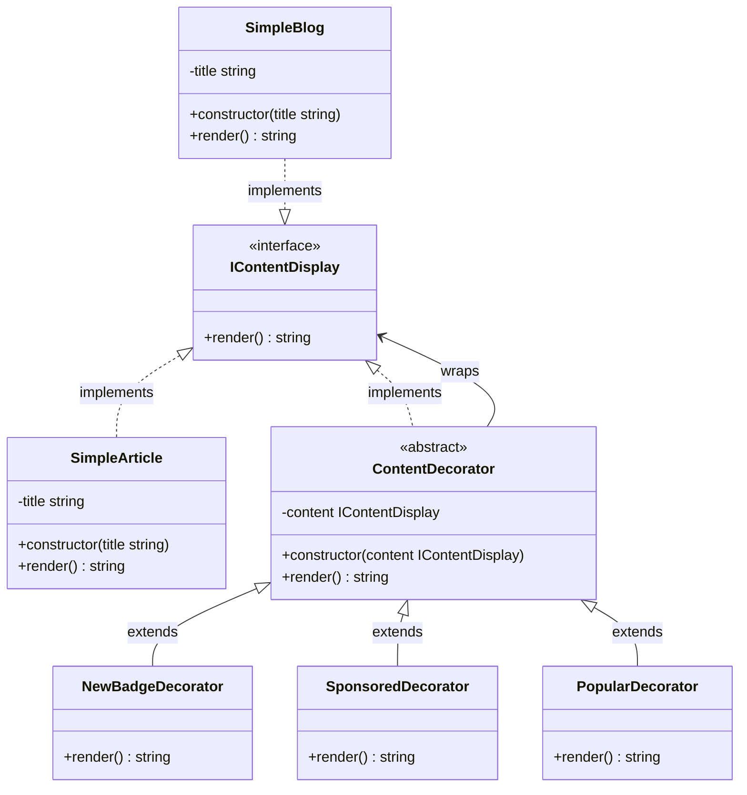
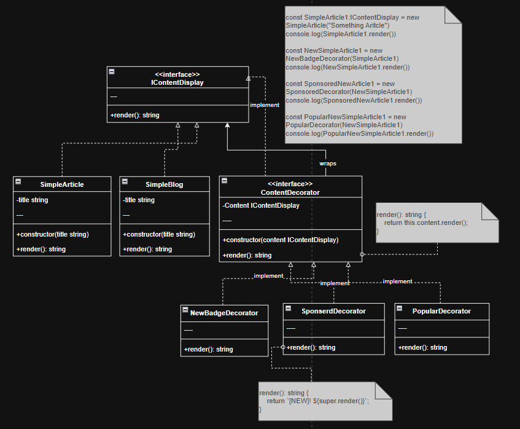

## Part of code is crucial

Client Code
```ts
const SimpleArticle1:IContentDisplay = new SimpleArticle("Something Aritcle")
console.log(SimpleArticle1.render())

const NewSimpleArticle1 = new NewBadgeDecorator(SimpleArticle1)
console.log(NewSimpleArticle1.render())

const SponsoredNewArticle1 = new SponsoredDecorator(NewSimpleArticle1)
console.log(SponsoredNewArticle1.render())

const PopularNewSimpleArticle1 = new PopularDecorator(NewSimpleArticle1)
console.log(PopularNewSimpleArticle1.render())
```
Decorator
```ts
render(): string {
        return this.content.render();
    }
```
Concrete Decorator
```ts
 render(): string {
        return `[NEW]! ${super.render()}`;
    }
```
## Decorator Component
- Component: IContentDisplay
- Concrete Component: SimpleArticle
- Decorator: ContentDecorator
- Concrete Decorators: NewBadgeDecorator, SponsoredDecorator
- Client: myPost


## Planning Scale in the Future
- เพิ่ม New Content ที่ต่างกัน เเล้วใช้ Adapter จัดการให้เข้ากับระบบ เเล้วให้ Decorator ห่อหุ้มต่อ
- เพิ่มการเเสดงผลที่ต่างกัน เช่น เเสดงผลเป็นวิดีโอ, รูปภาพ, ข้อความธรรมดา โดยใช้ Bridge Pattern ร่วมกับ Decorator Pattern
  


