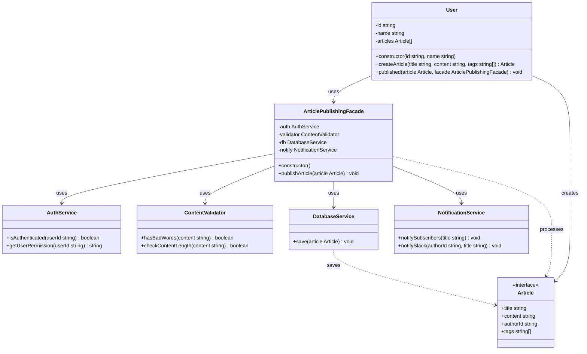

## Part of Code is Crucial
core facade
```ts
    private auth: AuthService;
    private validator: ContentValidator;
    private db: DatabaseService;
    private notify: NotificationService;

    constructor() {
        this.auth = new AuthService();
        this.validator = new ContentValidator();
        this.db = new DatabaseService();
        this.notify = new NotificationService();
    }
```
process execution subsystem
```ts
public publishArticle(article: Article): void {
        console.log(`Publishing Article: "${article.title}"`);
        console.log()
        // Authentication & Authorization
        if (!this.auth.isAuthenticated(article.authorId)) {
            throw new Error("❌ Unauthorized!");
        }
        this.auth.getUserPermission(article.authorId);

        // Content Validation
        if (this.validator.hasBadWords(article.content)) {
            throw new Error("❌ Content contains inappropriate words.");
        }
        if (!this.validator.checkContentLength(article.content)) {
            throw new Error("❌ Content too short!");
        }

        // Save to Database
        this.db.save(article);

        // Send Notifications
        this.notify.notifySubscribers(article.title);
        this.notify.notifySlack(article.authorId, article.title);

        console.log("\n=== ✅ Publishing Complete ===");
        console.log()
    }
```
process is calling facade
```ts
published(article: Article, facade: ArticlePublishingFacade): void {
        console.log(`\n👤 ${this.name} is publishing...`);
        facade.publishArticle(article);
    }
```
```ts
 createArticle(title: string, content: string, tags?: string[]): Article {
        const article: Article = {
            title,
            content,
            authorId: this.id,
            tags,
        };
        this.articles.push(article);
        console.log(`📝 ${this.name} created article: "${title}"`);
        return article;
    }
```

## Facade Component
- Facade: ArticlePublishingFacade ในอนาคต maintenance เป็น ContentPublishingFacade Adapter เพื่อรองรับ content หลายประเภท
- Subsystem Components:
  - AuthService
  - ContentValidator
  - DatabaseService
  - NotificationService
- Client: User

## Planning Scale
- เพิ่มจำนวน Subsystem ได้เรื่อยๆ เพื่อ manage , process content เช่น ImageProcessingService, 
- maintenance Content ปัจจุบัน content เจาะจงเเค่ Article วางเเผนเอา Adapter ปรับเข้ามาปรับใช้ เพื่อให้ content เข้ากับระบบ Facade ได้ เเต่มีข้อจัดกัดเรื่อง เรื่องที่ไม่สามารถเข้าถึง attribute บางตัวที่ต้องการ อาจจะหาเเผนในอนาคตเข้ามาจัดการเเทน

## Code Detaill is Crucial
- Facade Pattern ช่วยซ่อนความซับซ้อนของระบบย่อย (subsystem) โดยการให้ interface ที่ง่ายต่อการใช้งาน
- Client (User) ไม่จำเป็นต้องรู้รายละเอียดการทำงานภายในของ subsystem ต่างๆ
- Facade (ArticlePublishingFacade) ทำหน้าที่เป็นตัวกลางที่จัดการการสื่อสารระหว่าง Client กับ Subsystem
- ช่วยลดความซับซ้อนในการใช้งานระบบ ทำให้โค้ด


