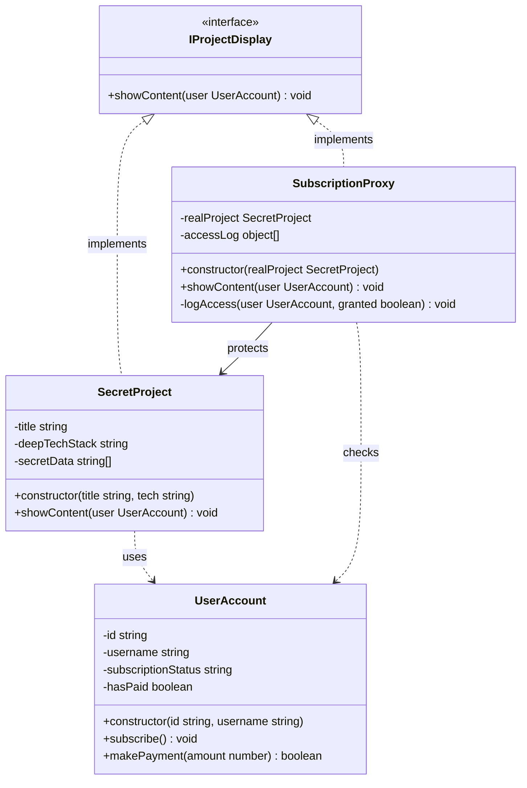
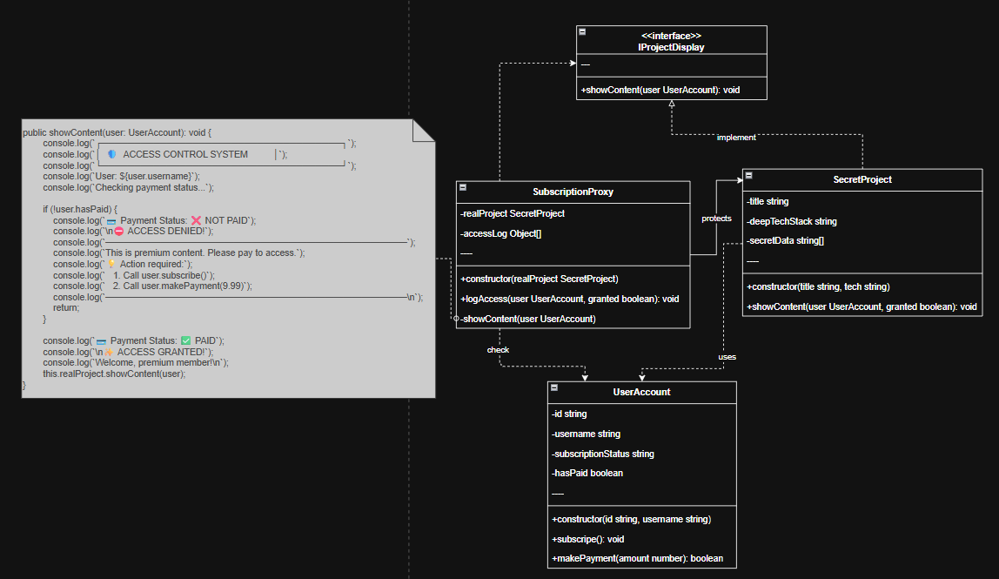

## Proxy Component
- Subject: IProjectDisplay
- Proxy: SubscriptionProxy
- Real Subject: SecretProject
- Client: UserAccount

## Planning Scale in the Future

จาก design pattern proxy ฉันเข้าใจเกี่ยวกับการ scale ของ proxy คือ 
- Real Object ตอนนี้ผูกขาดเป็น secretproject ในอนาคตมีเเผน scale โดยเอา adapter เข้ามาปรับใช้ไม่ว่า content จะเป็น อย่างไรใช้ Adapter เพื่อปรับให้ content ที่ต่างกันเข้ากับระบบทุกประเภท เเละเเบบนี้ก็ใช้ proxy ปกป้อง content ได้ทุกประเภท 

- proxy เข้าใจการ scale คือเพื่อ condition ต่างๆ เช่น ยกระดับ permission จากจ่ายเท่านี้เข้าได้เเค่นี้ จ่ายเท่านี้เข้าได้ทั้ง ถ้าเป็น subscrition ครบ 1 ปีหรือมากกว่าเเล้วเเต่เรา ก็สามารถ proxy เพิ่มขึ้นไปเรื่อยๆ ส่วนนี้คิดว่าน่าจะเอา design pattern อื่นๆ มาช่วยได้ เช่น COR, Decorator เเค่คิดเรื่อง process เเละ chain เพิ่มเติมเเต่งเข้าไปด้วย decorator

- subject ยังไม่รู้จะ scale เป็นอะไรได้บ้าง มีอยากเเนะนำก็บอกมาได้

## Code Detail is Crucial

```ts
public showContent(user: UserAccount): void {
        console.log(`┌─────────────────────────────────────┐`);
        console.log(`│  🛡️  ACCESS CONTROL SYSTEM          │`);
        console.log(`└─────────────────────────────────────┘`);
        console.log(`User: ${user.username}`);
        console.log(`Checking payment status...`);

        if (!user.hasPaid) {
            console.log(`💳 Payment Status: ❌ NOT PAID`);
            console.log(`\n⛔ ACCESS DENIED!`);
            console.log(`━━━━━━━━━━━━━━━━━━━━━━━━━━━━━━━━━`);
            console.log(`This is premium content. Please pay to access.`);
            console.log(`💡 Action required:`);
            console.log(`   1. Call user.subscribe()`);
            console.log(`   2. Call user.makePayment(9.99)`);
            console.log(`━━━━━━━━━━━━━━━━━━━━━━━━━━━━━━━━━\n`);
            return;
        }

        console.log(`💳 Payment Status: ✅ PAID`);
        console.log(`\n✨ ACCESS GRANTED!`);
        console.log(`Welcome, premium member!\n`);
        this.realProject.showContent(user);
}
```


