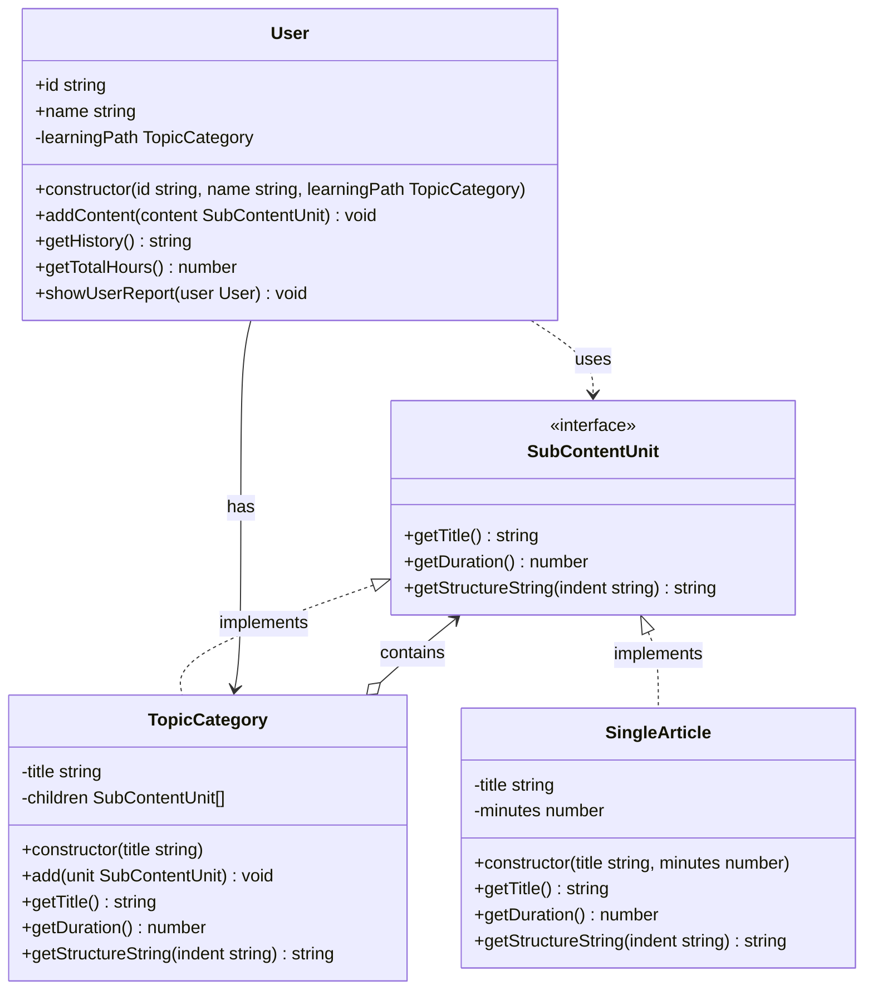
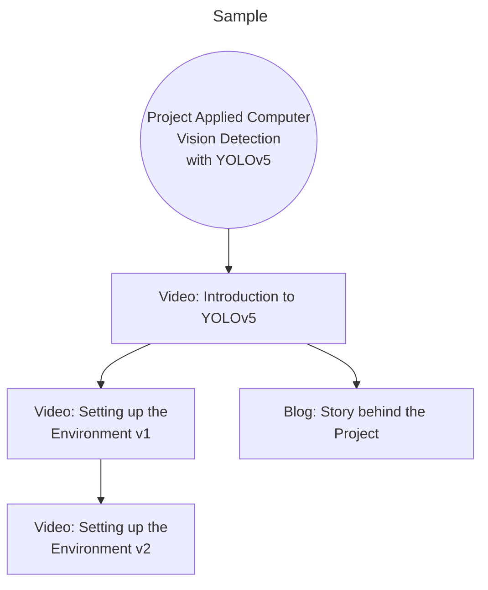
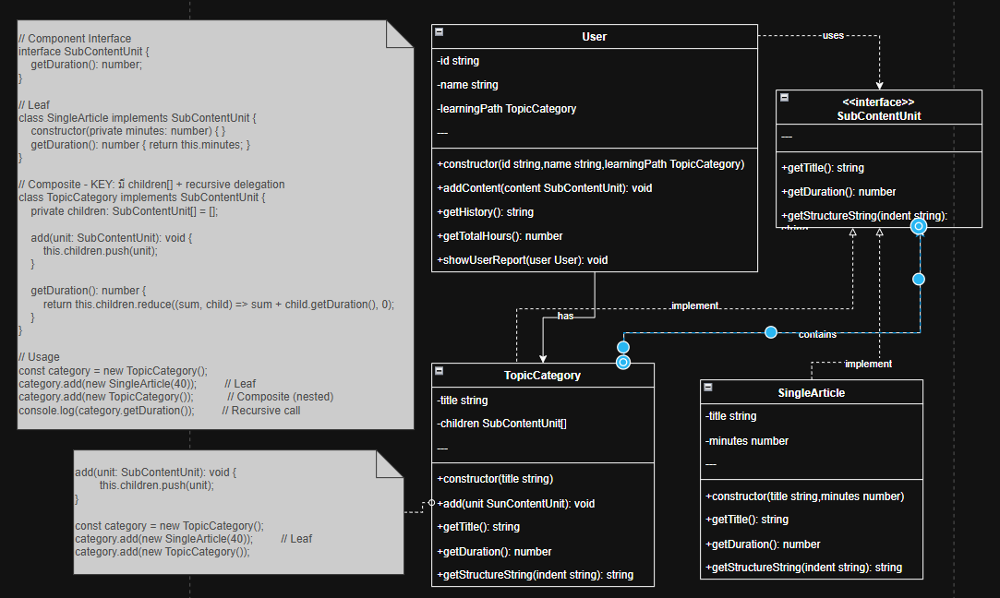

## Part of code is crucial
```ts
add(unit: SubContentUnit): void {
        this.children.push(unit);
}
    
const category = new TopicCategory();
category.add(new SingleArticle(40));         // Leaf
category.add(new TopicCategory());
```
```ts
// Component Interface
interface SubContentUnit {
    getDuration(): number;
}

// Leaf
class SingleArticle implements SubContentUnit {
    constructor(private minutes: number) { }
    getDuration(): number { return this.minutes; }
}

// Composite - KEY: มี children[] + recursive delegation
class TopicCategory implements SubContentUnit {
    private children: SubContentUnit[] = [];
    
    add(unit: SubContentUnit): void {
        this.children.push(unit);
    }
    
    getDuration(): number {
        return this.children.reduce((sum, child) => sum + child.getDuration(), 0);
    }
}

// Usage
const category = new TopicCategory();
category.add(new SingleArticle(40));         // Leaf
category.add(new TopicCategory());           // Composite (nested)
console.log(category.getDuration());         // Recursive call
```

## Composite Component
- Component: SubContentUnit
- Leaf: SingleArticle
- Composite: TopicCategory
- Client: User

## Planning in the future scale
- ตอนนี้ content เราเจาะจงไปที่ Article อย่างเดียว ว่าเเผน maintenance ในอนาคต โดนหยิบ adapter เข้ามาช่วย เหมือนเราเอาไป render จากไอเดีย facotory method ก็จะได้ Content ที่เหมือนกันเเละเข้ากับระบบได้ตอน render 
- ตัวอย่าง สถานการณ์มี Content Project Applied Computer Vision Detection with YOLOv5 เป็น Project เเต่ตอน render เเสดงจะเเสดงเป็น format Content ที่ผ่าน Adapter มาเเล้ว เเละมี Sub Content ที่เกี่ยวกับ Project เเต่เป็น Video อธิบาย เเละ มี sub content video อื่นที่เกี่ยวข้องอีก เเละ Blog อธิบาย Story ของ Project 
- **Idea**
    - ตอนนี้ใช้ไอเดีย Composite pattern ในการจัดการเอา Content ที่วางเเผนจะทำในอนาคต คือ render content เเบบ composite
    - ไปใช้กับ User Bookmark ในอนาคตถ้า User อยาก Bookmark content ที่เกี่ยวข้องกันเป็นกลุ่มๆ เเทนที่จะ bookmark ทีละ content ก็สามารถ bookmark เป็นกลุ่มได้เลย โดยใช้ Composite pattern 
    - มีไอเดียเรื่องการ render โดยใช้ composite กับ factory method เเต่ยังไม่รู้จะทำอย่างไร ยกตัวอย่างสถานการณ์ มี nested content คือ มี content ที่ tree ลงไปเรื่อยเเต่จะเอา factory method จัดการการ render layout ที่ต่างกัน เช่น root content เป็น List , sub content เป็น Grid ถ้ามี sub content เเบบคู่อันนึงเป็น List อีกอันเป็น Grid คิดเฉยๆ ไม่รู้เหมือนกันจะมีประโยชน์อย่างไร

## Structure Diagram Explain



