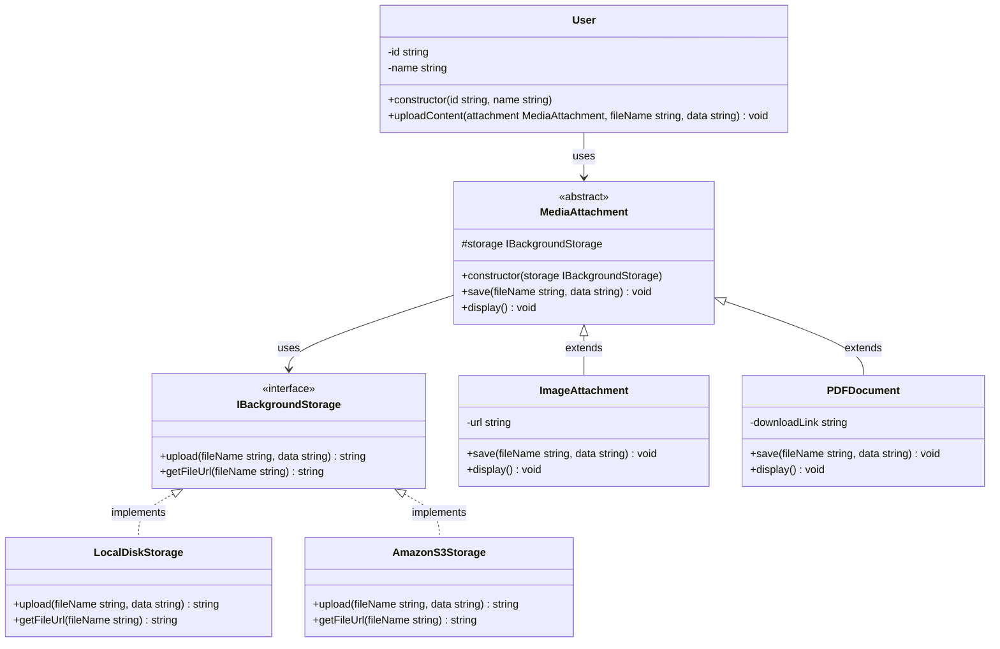

## Part of code is crucial
```ts
    save(fileName: string, data: string): void {
        console.log("Processing Image (Resizing/Compressing)...");
        this.url = this.storage.upload(fileName, data);
    }
    
```
```ts
    uploadContent(attachment: MediaAttachment, fileName: string, data: string) {
        attachment.save(fileName, data);
        attachment.display();
    }
```

## Bridge Component
- Implementor: `IBackgroundStorage`
- Concrete Implementor: `LocalDiskStorage`, `AmazonS3Storage`
- Abstraction: `MediaAttachment`, `ImageAttachment`, `PDFDocument`
- Client: `User`


## Planing Scale in the Future
- เพิ่มที่จัดเก็บ storage เเบบอื่นๆ `IBackgroundStorage` implementations (e.g., `GoogleCloudStorage`, `AzureBlobStorage`)
- เพิ่มประเภท content เเบบอื่นๆ `MediaAttachment` อื่นๆ (e.g., `VideoAttachment`, `AudioAttachment`)


