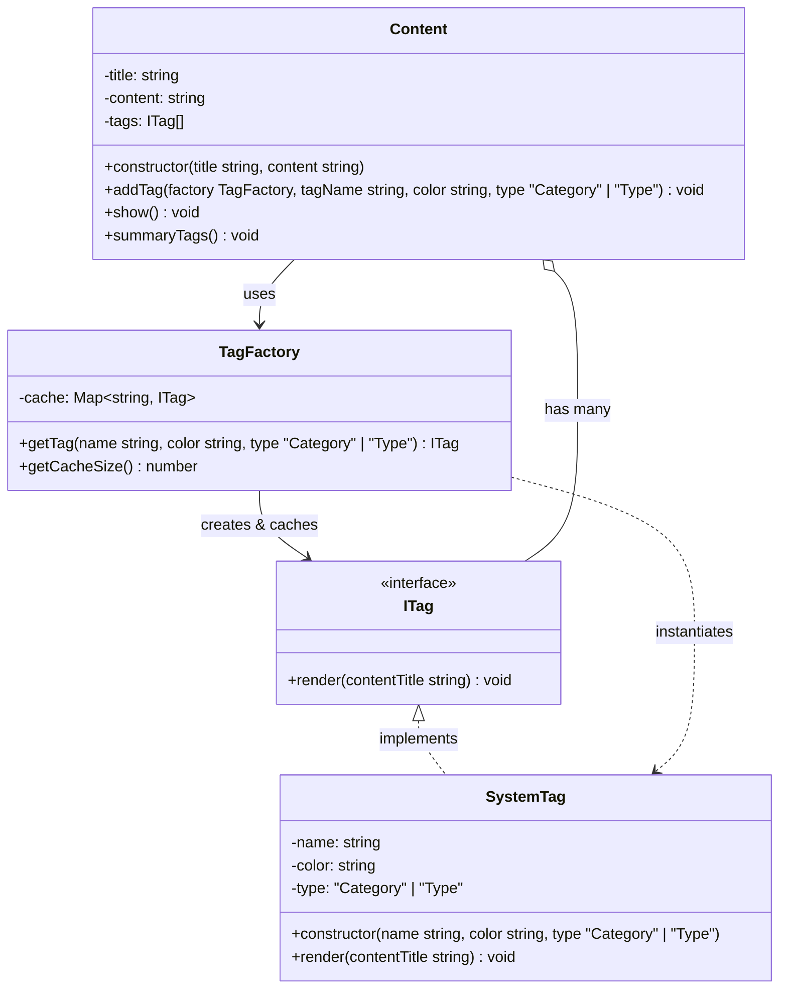
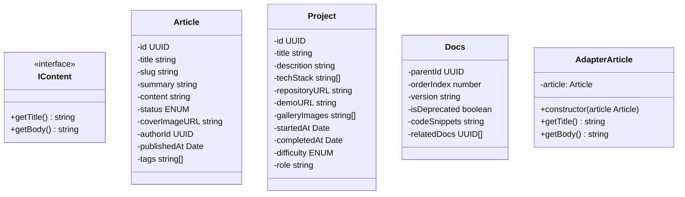
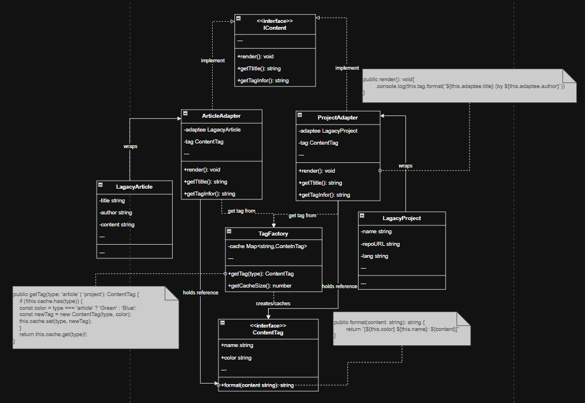

## Part of code is crucial
```ts
 public addTag(factory: TagFactory, tagName: string, color: string, type: "Category" | "Type") {
        const tag = factory.getTag(tagName, color, type);
        this.tags.push(tag);
    }
```

```ts
public getTag(name: string, color: string, type: "Category" | "Type"): ITag {
        const key = `${name}-${type}`;

        if (this.cache.has(key)) {
            return this.cache.get(key)!;
        }

        const newTag = new SystemTag(name, color, type);
        this.cache.set(key, newTag);
        console.log(`✨ Create new tag -> [${name}]`);
        return newTag;
    }
```

## Flyweight Component
- **Flyweight Interface**: `ITag`
- **Concrete Flyweight**: `SystemTag`
- **Flyweight Factory**: `TagFactory`
- **Client**: `Content`

## Planning Scale in The Future

## Problem

## Solution with Flyweight Pattern




