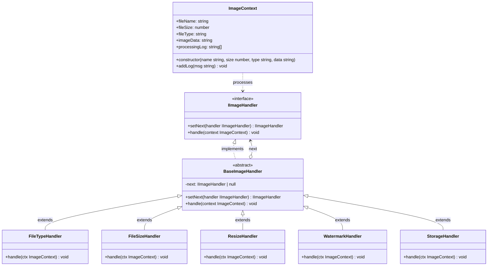
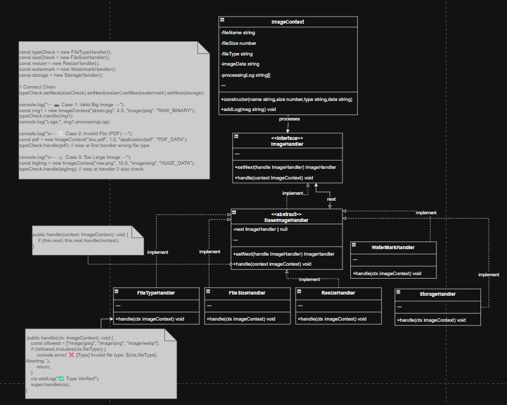

## Part of code is crucial
```ts
const typeCheck = new FileTypeHandler();
const sizeCheck = new FileSizeHandler();
const resizer = new ResizeHandler();
const watermark = new WatermarkHandler();
const storage = new StorageHandler();

// Connect Chain
typeCheck.setNext(sizeCheck).setNext(resizer).setNext(watermark).setNext(storage);

console.log("--- 📸 Case 1: Valid Big Image ---");
const img1 = new ImageContext("photo.jpg", 4.5, "image/jpeg", "RAW_BINARY");
typeCheck.handle(img1);
console.log("Logs:", img1.processingLog);

console.log("\n--- 📄 Case 2: Invalid File (PDF) ---");
const pdf = new ImageContext("doc.pdf", 1.0, "application/pdf", "PDF_DATA");
typeCheck.handle(pdf); // stop at first handler wrong file type

console.log("\n--- 🐘 Case 3: Too Large Image ---");
const bigImg = new ImageContext("raw.png", 10.0, "image/png", "HUGE_DATA");
typeCheck.handle(bigImg); // stop at handler 2 size check
```

```ts
 public handle(context: ImageContext): void {
        if (this.next) this.next.handle(context);
    }
```

```ts
 public handle(ctx: ImageContext): void {
        const allowed = ["image/jpeg", "image/png", "image/webp"];
        if (!allowed.includes(ctx.fileType)) {
            console.error(`❌ [Type] Invalid file type: ${ctx.fileType}. Aborting.`);
            return; // Break Chain
        }
        ctx.addLog("✅ Type Verified");
        super.handle(ctx);
    }
```
```ts
public handle(ctx: ImageContext): void {
        if (ctx.fileSize > 5) { // Limit 5MB
            console.error(`❌ [Size] File too large (${ctx.fileSize}MB). Limit is 5MB.`);
            return; // Break Chain
        }
        ctx.addLog("✅ Size OK");
        super.handle(ctx);
    }
```
```ts
public handle(ctx: ImageContext): void {
        console.log("📉 [Resize] Processing image dimensions...");
        // Simulation: ถ้ารูปใหญ่กว่า 2MB ให้ย่อเหลือ 1MB
        if (ctx.fileSize > 2) {
            ctx.fileSize = 1;
            ctx.imageData = ctx.imageData + "[RESIZED]"; // Data เปลี่ยนร่าง
            ctx.addLog("✅ Resized to 1080p");
        } else {
            ctx.addLog("ℹ️ No resize needed");
        }
        super.handle(ctx);
    }
```

```ts
public handle(ctx: ImageContext): void {
        console.log("💧 [Watermark] Adding logo to bottom-right...");
        ctx.imageData = ctx.imageData + "[WATERMARKED]";
        ctx.addLog("✅ Watermark Added");
        super.handle(ctx);
    }
```

```ts
 public handle(ctx: ImageContext): void {
        console.log(`💾 [Storage] Saving ${ctx.fileName} to /uploads...`);
        console.log(`   Final Data: ${ctx.imageData}`);
        console.log("🎉 UPLOAD COMPLETE!");
    }
```

## COR Component
- Context: ImageContext
- Handler Interface: IImageHandler
- Base Handler: BaseImageHandler
- Concrete Handlers: FileTypeHandler, FileSizeHandler, ResizeHandler, WatermarkHandler, StorageHandler

## Planning Scale in the Future
- อาจต้องไปหา ไอเดียใหม่ๆ เพิ่มเติมเกี่ยวกับการ scale ส่วนของ context ว่าจะเอาอะไรมาเล่นได้บ้าง
- เพิ่มจำนวน handlers เช่น CompressionHandler, MetadataHandler
- รองรับ asynchronous processing (Promises)
- เพิ่ม logging และ error handling ที่ละเอียดขึ้น
- ทำให้ chain สามารถปรับเปลี่ยนได้ runtime (dynamic chain)
- รองรับ parallel processing สำหรับบาง handlers


