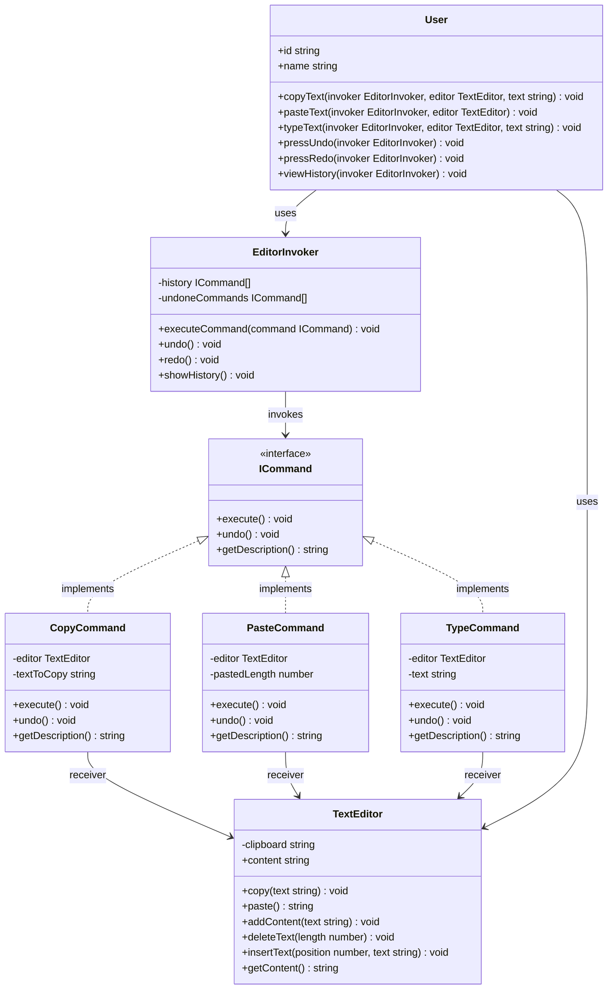

```mermaid
classDiagram
    class TextEditor {
        -clipboard string
        +content string
        +copy(text string) void
        +paste() string
        +addContent(text string) void
        +deleteText(length number) void
        +insertText(position number, text string) void
        +getContent() string
    }
    
    class ICommand {
        <<interface>>
        +execute() void
        +undo() void
        +getDescription() string
    }
    
    class CopyCommand {
        -editor TextEditor
        -textToCopy string
        +execute() void
        +undo() void
        +getDescription() string
    }
    
    class PasteCommand {
        -editor TextEditor
        -pastedLength number
        +execute() void
        +undo() void
        +getDescription() string
    }
    
    class TypeCommand {
        -editor TextEditor
        -text string
        +execute() void
        +undo() void
        +getDescription() string
    }
    
    class EditorInvoker {
        -history ICommand[]
        -undoneCommands ICommand[]
        +executeCommand(command ICommand) void
        +undo() void
        +redo() void
        +showHistory() void
    }
    
    class User {
        +id string
        +name string
        +copyText(invoker EditorInvoker, editor TextEditor, text string) void
        +pasteText(invoker EditorInvoker, editor TextEditor) void
        +typeText(invoker EditorInvoker, editor TextEditor, text string) void
        +pressUndo(invoker EditorInvoker) void
        +pressRedo(invoker EditorInvoker) void
        +viewHistory(invoker EditorInvoker) void
    }
    
    ICommand <|.. CopyCommand : implements
    ICommand <|.. PasteCommand : implements
    ICommand <|.. TypeCommand : implements
    CopyCommand --> TextEditor : receiver
    PasteCommand --> TextEditor : receiver
    TypeCommand --> TextEditor : receiver
    EditorInvoker --> ICommand : invokes
    User --> EditorInvoker : uses
    User --> TextEditor : uses
```