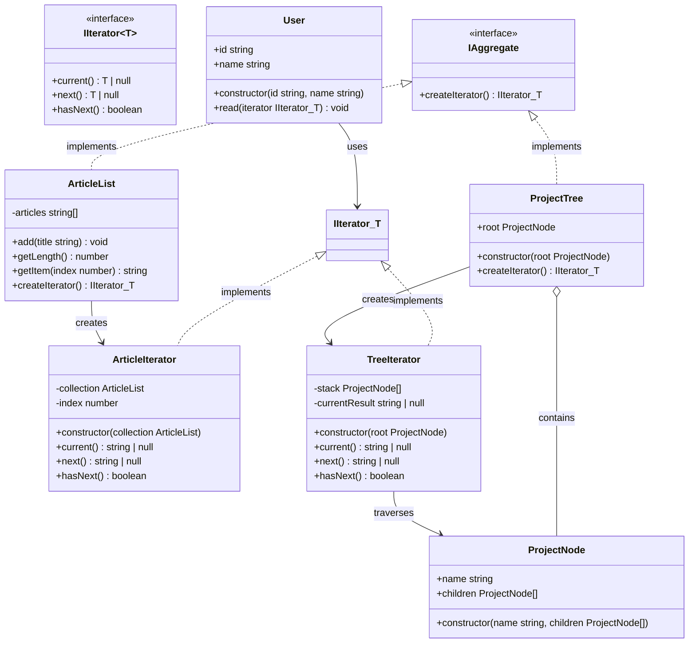

```mermaid
classDiagram
    class IIterator~T~ {
        <<interface>>
        +current() T | null
        +next() T | null
        +hasNext() boolean
    }
    
    class IAggregate {
        <<interface>>
        +createIterator() IIterator_T
    }
    
    class ArticleList {
        -articles string[]
        +add(title string) void
        +getLength() number
        +getItem(index number) string
        +createIterator() IIterator_T
    }
    
    class ArticleIterator {
        -collection ArticleList
        -index number
        +constructor(collection ArticleList)
        +current() string | null
        +next() string | null
        +hasNext() boolean
    }
    
    class ProjectNode {
        +name string
        +children ProjectNode[]
        +constructor(name string, children ProjectNode[])
    }
    
    class ProjectTree {
        +root ProjectNode
        +constructor(root ProjectNode)
        +createIterator() IIterator_T
    }
    
    class TreeIterator {
        -stack ProjectNode[]
        -currentResult string | null
        +constructor(root ProjectNode)
        +current() string | null
        +next() string | null
        +hasNext() boolean
    }
    
    class User {
        +id string
        +name string
        +constructor(id string, name string)
        +read(iterator IIterator_T) void
    }
    
    IIterator_T <|.. ArticleIterator : implements
    IIterator_T <|.. TreeIterator : implements
    IAggregate <|.. ArticleList : implements
    IAggregate <|.. ProjectTree : implements
    ArticleList --> ArticleIterator : creates
    ProjectTree --> TreeIterator : creates
    ProjectTree o-- ProjectNode : contains
    TreeIterator --> ProjectNode : traverses
    User --> IIterator_T : uses
```