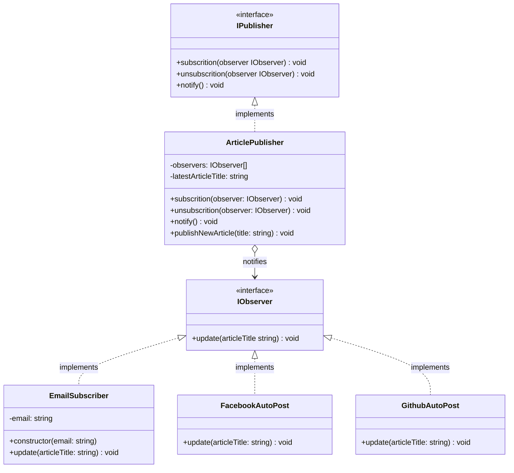
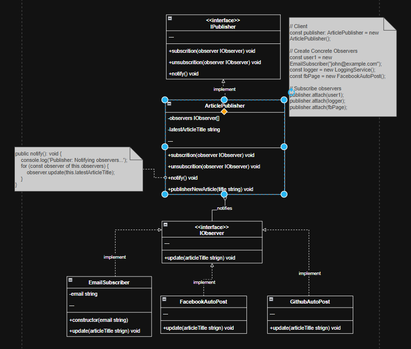

## Part of code is crucial
```ts
public subscrition(observer: IObserver): void {
        const isExist = this.observers.includes(observer);
        if (isExist) {
            return console.log('Publisher: Observer has been attached already.');
        }
        console.log('Publisher: Attached an observer.');
        this.observers.push(observer);
    }

public unsubscrition(observer: IObserver): void {
        const observerIndex = this.observers.indexOf(observer);
        if (observerIndex === -1) {
            return console.log('Publisher: Nonexistent observer.');
        }
        this.observers.splice(observerIndex, 1);
        console.log('Publisher: Detached an observer.');
    }
public notify(): void {
        console.log('Publisher: Notifying observers...');
        for (const observer of this.observers) {
            observer.update(this.latestArticleTitle);
        }
    }
```

```ts
// Client
const publisher: ArticlePublisher = new ArticlePublisher();

// Create Concrete Observers
const user1 = new EmailSubscriber("john@example.com");
const logger = new LoggingService();
const fbPage = new FacebookAutoPost();

// Subscribe observers
publisher.attach(user1);
publisher.attach(logger);
publisher.attach(fbPage);
```

## Observer Component
- **Observer Interface**: `IObserver`
- **Concrete Observers**: `EmailSubscriber`, `LoggingService`, `FacebookAutoPost`
- **Subject Interface**: `ISubject`
- **Concrete Subject**: `ArticlePublisher`

## Planning Scale in The Future
- เพิ่ม ประเภท Observer ใหม่ๆ ได้ง่าย เช่น TwitterAutoPost, SlackNotifier
- ขยายฟีเจอร์ Subject ให้รองรับการจัดการบทความหลายประเภท (เช่น ข่าวสาร, บทความวิชาการ) ใช้ adapter ปรับใช้ไม่ว่า content เป็นอย่างไรใคร subscribe ก็ได้รับ update
- เพิ่มฟีเจอร์กรองการแจ้งเตือน เช่น ให้ผู้ใช้เลือกประเภทบทความที่สนใจได้ เพิ่ม condition ในการส่ง level เเค่คิดผ่านสามารถเอา singleton , decorator เข้ามาใช้ได้ไหม
- จะเห็นการ public article ค่อนข้างเจาะจง สามารถใช้ adapter ปรับ content ได้หลากหลายรูปเเบบ เช่น video, podcast, blog post เเค่ใส่ content เข้าไปก็เเจ้งเตือนได้เลย
- มีเเผนการเเจ้งเตือนเฉพาะกลุ่ม เช่น VIP user, free user, subscriber user อาจจะใช้ strategy pattern ช่วยในการจัดการกลุ่มผู้ใช้เเต่ละประเภท โดยจะสร้าง concrete publisher เเต่ละประเภทขึ้นมา
- scale เเบบ 2D สามารถเพิ่มได้การส่งการเเจ้งเตือนไปทางบ้าง กับ ส่งเเจ้งเตือนเฉพาะกลุ่ม

## Problem 

## Solution


