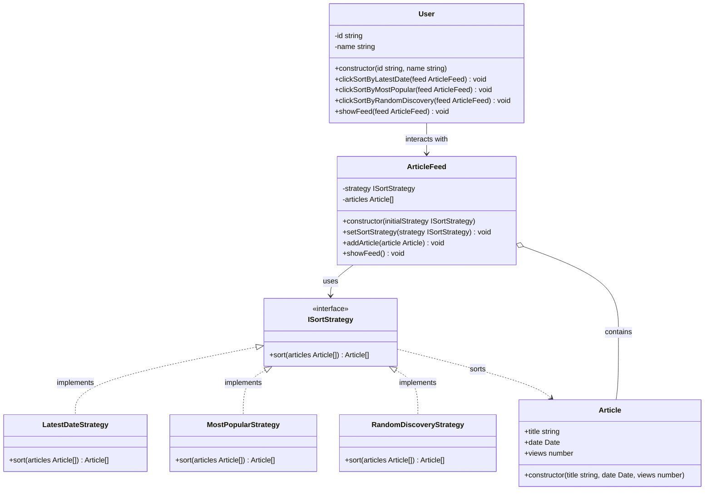

## Strategy Component
- Strategy: ISortStrategy
- Concrete Strategies: LatestDateStrategy, MostPopularStrategy, RandomDiscoveryStrategy
- Context: ArticleFeed
- Client: User
- Product: Article

## Part of code is crucial

- สำคัญปัจจุบัน content จะ sort เเบบไหน ก็ขึ้นอยู่ว่า ContentFeed รับ หรือ set strategy อะไรเข้ามา 
```ts
 public showFeed() {
        const sorted = this.strategy.sort(this.articles);

        console.log("--- Current Feed ---");
        sorted.forEach(a => {
            console.log(`- ${a.title} (Views: ${a.views}, Date: ${a.date.toLocaleDateString()})`);
        });
        console.log("--------------------\n");
    }
```
- demo
```ts
const feed = new ArticleFeed(new LatestDateStrategy()); 

feed.addArticle(new Article("Intro to Strategy", new Date('2026-01-20'), 1500));
feed.addArticle(new Article("Advanced TypeScript", new Date('2026-01-25'), 500)); // ใหม่สุด แต่วิวน้อย
feed.addArticle(new Article("Viral AI Trends", new Date('2026-01-10'), 9000)); // เก่าหน่อย แต่วิวเยอะ

const user1 = new User("u100", "John Doe");

user1.clickSortByLatestDate(feed);
user1.showFeed(feed);

user1.clickSortByMostPopular(feed);
user1.showFeed(feed);

user1.clickSortByRandomDiscovery(feed);
user1.showFeed(feed);

console.log("User clicks 'Popular' tab:");
feed.setSortStrategy(new MostPopularStrategy()); // <--- สลับไส้ในตรงนี้
feed.showFeed();
// Output: Viral AI Trends -> Intro to Strategy -> Advanced TypeScript

console.log("User clicks 'Surprise Me':");
feed.setSortStrategy(new RandomDiscoveryStrategy());
feed.showFeed();
```

## Planning Scale in the Future
- ก่อนอื่นใช้ adapter ปรับ content ที่ต่างกันให้เข้าได้ โดยใช้ adapter หลังจากนี้ add content บนหน้า feed เเบบไหนก็ได้ก็จะเเสดงเเบบเดียวกัน
- ใช้ strategy pattern ในการจัดการ content เช่น  search , filter 
- ใช้ strategy pattern ในการเเสดงผล feed เเบบต่างๆ (list view, grid view, card view) จริงๆ ตรงนี้คิดว่าจะใช้ factory method ในการจัดการ เเต่ต้องวางเเผนใหม่ว่า จะใช้ strategy ร่วมหรือเเทน factory method 
- ใช้ strategy pattern ในการปรับ feed ตามพฤติกรรมผู้ใช้ (personalization strategy) กลยุทธ์ คือ เอาข้อมูลที่ได้จาก singleton มาช่วยวิเคราะห์ พฤติกรรมผู้ใช้ เเล้วปรับ feed
- ใช้ strategy pattern ในการจัดการโฆษณาบน feed (ad placement strategy) ใช้ singleton ควมคู่กับ decorator content พิเศษ เช่น new , sponsored , hot , popular , discount 
- การเพิ่ม field content จะช่วยให้เราคิดเเละเพิ่ม strategy ได้ง่ายขึ้น เช่น category , tags , author , length , difficulty level , format (video, article, podcast) จะเห็นว่าถ้าเราใช้เเค่ strategy เดียวอย่าง sort ก็เล่นกับ field ข้อมูลได้หลายประเภท ในอนาคตอาจจะมีท่าอื่นๆ ที่ซับซ้อนขึ้น sort หรือ filter เเบบ multi field ก็ได้


