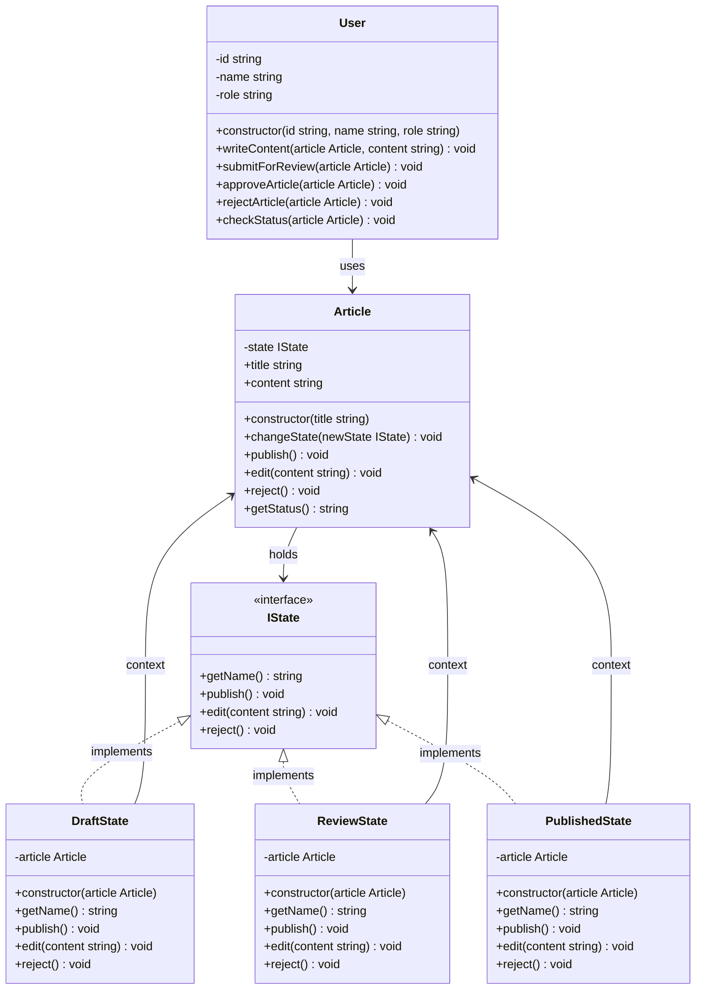

```mermaid
classDiagram
    class Article {
        -state IState
        +title string
        +content string
        +constructor(title string)
        +changeState(newState IState) void
        +publish() void
        +edit(content string) void
        +reject() void
        +getStatus() string
    }
    
    class IState {
        <<interface>>
        +getName() string
        +publish() void
        +edit(content string) void
        +reject() void
    }
    
    class DraftState {
        -article Article
        +constructor(article Article)
        +getName() string
        +publish() void
        +edit(content string) void
        +reject() void
    }
    
    class ReviewState {
        -article Article
        +constructor(article Article)
        +getName() string
        +publish() void
        +edit(content string) void
        +reject() void
    }
    
    class PublishedState {
        -article Article
        +constructor(article Article)
        +getName() string
        +publish() void
        +edit(content string) void
        +reject() void
    }
    
    class User {
        -id string
        -name string
        -role string
        +constructor(id string, name string, role string)
        +writeContent(article Article, content string) void
        +submitForReview(article Article) void
        +approveArticle(article Article) void
        +rejectArticle(article Article) void
        +checkStatus(article Article) void
    }
    
    IState <|.. DraftState : implements
    IState <|.. ReviewState : implements
    IState <|.. PublishedState : implements
    Article --> IState : holds
    DraftState --> Article : context
    ReviewState --> Article : context
    PublishedState --> Article : context
    User --> Article : uses
```