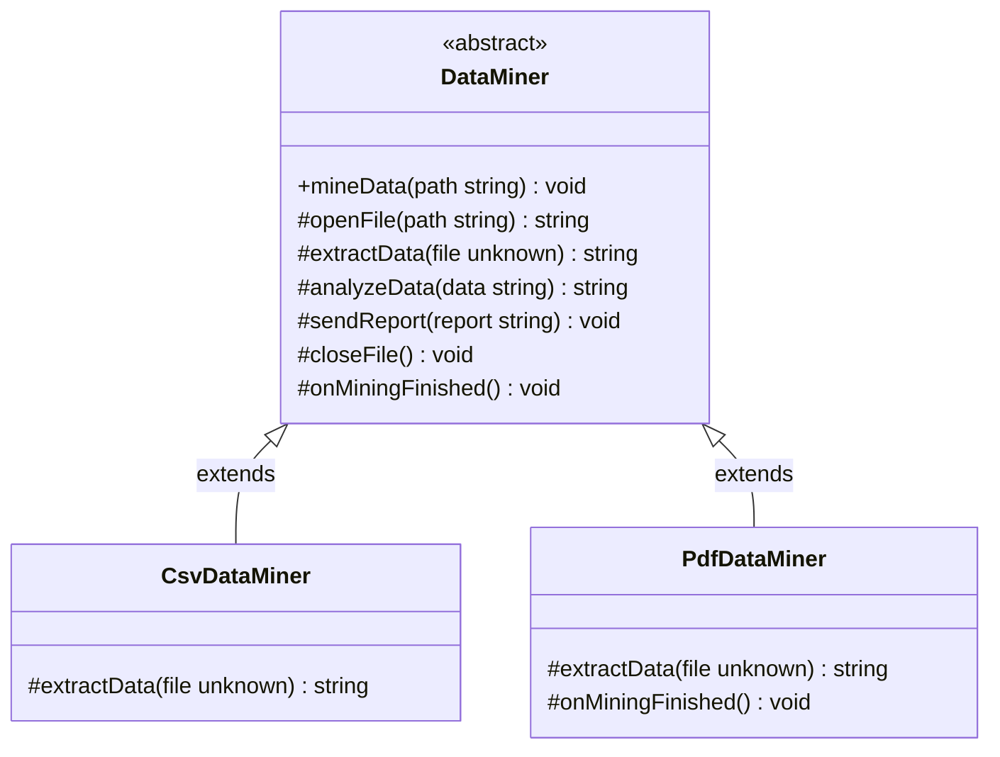

```mermaid
classDiagram
    class DataMiner {
        <<abstract>>
        +mineData(path string) void
        #openFile(path string) string
        #extractData(file unknown) string
        #analyzeData(data string) string
        #sendReport(report string) void
        #closeFile() void
        #onMiningFinished() void
    }
    
    class CsvDataMiner {
        #extractData(file unknown) string
    }
    
    class PdfDataMiner {
        #extractData(file unknown) string
        #onMiningFinished() void
    }
    
    DataMiner <|-- CsvDataMiner : extends
    DataMiner <|-- PdfDataMiner : extends
```