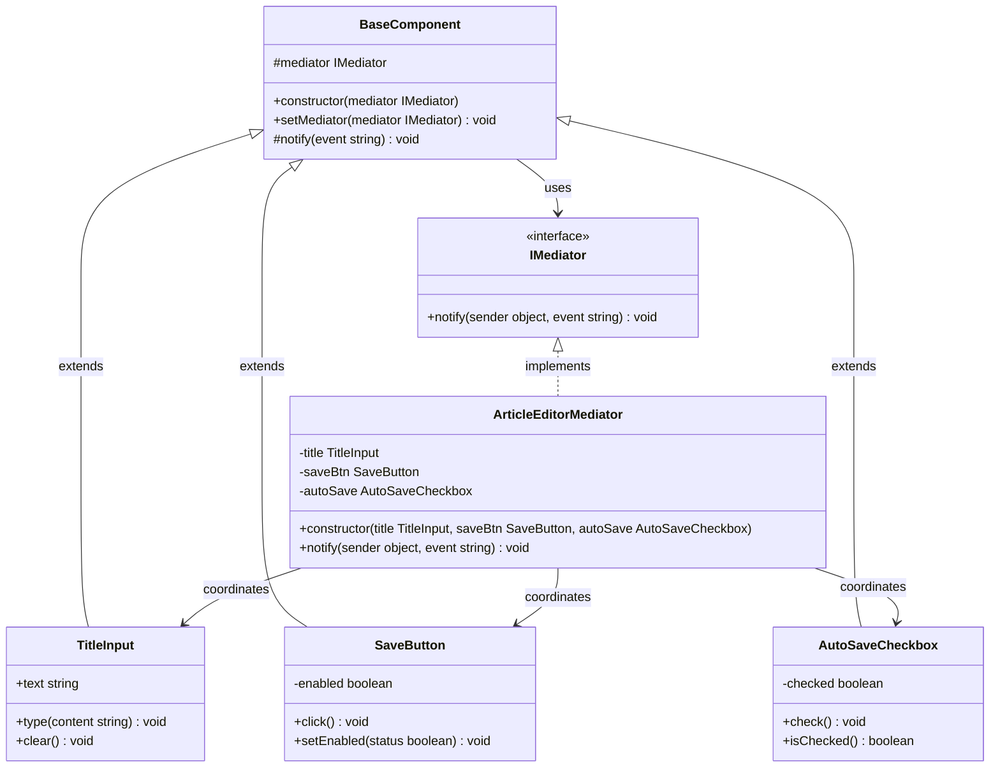

```mermaid
classDiagram
    class IMediator {
        <<interface>>
        +notify(sender object, event string) void
    }
    
    class BaseComponent {
        #mediator IMediator
        +constructor(mediator IMediator)
        +setMediator(mediator IMediator) void
        #notify(event string) void
    }
    
    class TitleInput {
        +text string
        +type(content string) void
        +clear() void
    }
    
    class SaveButton {
        -enabled boolean
        +click() void
        +setEnabled(status boolean) void
    }
    
    class AutoSaveCheckbox {
        -checked boolean
        +check() void
        +isChecked() boolean
    }
    
    class ArticleEditorMediator {
        -title TitleInput
        -saveBtn SaveButton
        -autoSave AutoSaveCheckbox
        +constructor(title TitleInput, saveBtn SaveButton, autoSave AutoSaveCheckbox)
        +notify(sender object, event string) void
    }
    
    BaseComponent <|-- TitleInput : extends
    BaseComponent <|-- SaveButton : extends
    BaseComponent <|-- AutoSaveCheckbox : extends
    IMediator <|.. ArticleEditorMediator : implements
    ArticleEditorMediator --> TitleInput : coordinates
    ArticleEditorMediator --> SaveButton : coordinates
    ArticleEditorMediator --> AutoSaveCheckbox : coordinates
    BaseComponent --> IMediator : uses
```