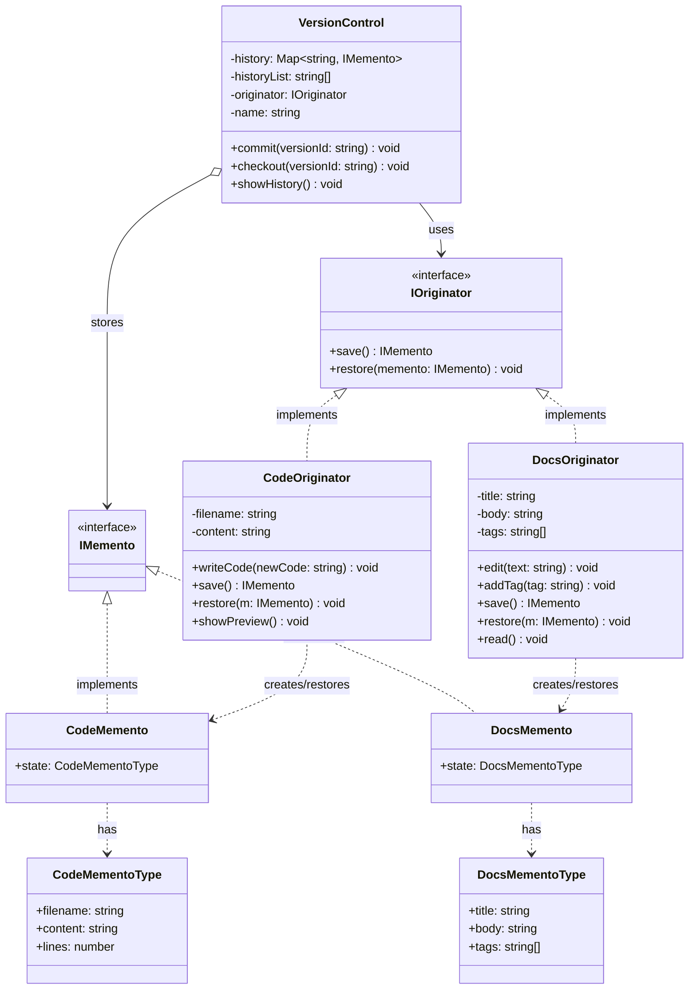

## Part of code is crucial
- **Originator (CodeOriginator)**
```ts
public save(): IMemento {
    return new CodeMemento({
        filename: this.filename,
        content: this.content,
        lines: this.content.split('\n').length
    });
}
```
- **Originator (CodeOriginator)**
```ts
public restore(m: IMemento): void {
    if (!(m instanceof CodeMemento)) {
        console.error(`❌ Error: Invalid memento type!`);
        return;
    }
    this.filename = m.state.filename;
    this.content = m.state.content;
    console.log(`⏪ Reverted ${this.filename}`);
}
```
- **Caretaker**
```ts
public commit(versionId: string): void {
    const memento = this.originator.save();
    this.history.set(versionId, memento);
    this.historyList.push(versionId);
    console.log(`💾 Committed snapshot: "${versionId}"`);
}
```
- **Caretaker**
```ts
public checkout(versionId: string): void {
    const memento = this.history.get(versionId);
    if (!memento) {
        console.error(`❌ Version "${versionId}" not found.`);
        return;
    }
    this.originator.restore(memento);
}
```


## Planning Scale in the Future
- ตอนนี้เราเก็บเเค่ title, detail, version เเต่ถ้าในอนาคต เราอยากเก็บ state อื่นๆ เช่น lastModified, author เราก็สามารถเพิ่มได้ง่ายๆ โดยไม่กระทบ code ที่ใช้ class Content เเละ VersionControl อยู่
- ถ้าเราอยากเพิ่มฟีเจอร์ เช่น auto-save, diff view เราก็สามารถสร้าง class ใหม่ที่ใช้ ContentMemento ได้เลย โดยไม่ต้องไปยุ่งกับ class Content หรือ VersionControl
- scale caretaker เพิ่มเติม เช่น DraftManager, QuickHistory ก็สามารถทำได้ง่ายๆ โดยใช้ IMemento เหมือนกัน

## Memento Component
- **Memento Interface**: `IMemento` (marker interface)
- **Concrete Mementos**: `CodeMemento`, `DocsMemento`
- **Originator Interface**: `IOriginator`
- **Concrete Originators**: `CodeOriginator`, `DocsOriginator`
- **Caretaker**: `VersionControl`

## Purpose of Memento Pattern
- เพื่อเก็บ snapshot ของ object state ในช่วงเวลาหนึ่งๆ โดยไม่ยุ่งกับ encapsulation
- เพื่อให้สามารถย้อนกลับไปยัง state ก่อนหน้าได้ง่ายๆ
- เพื่อแยกความรับผิดชอบในการจัดการ state ออกจาก object หลัก


