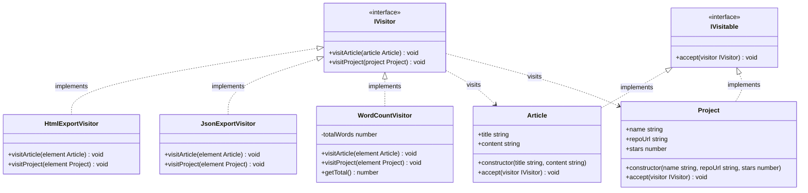

```mermaid
classDiagram
    class IVisitor {
        <<interface>>
        +visitArticle(article Article) void
        +visitProject(project Project) void
    }
    
    class IVisitable {
        <<interface>>
        +accept(visitor IVisitor) void
    }
    
    class Article {
        +title string
        +content string
        +constructor(title string, content string)
        +accept(visitor IVisitor) void
    }
    
    class Project {
        +name string
        +repoUrl string
        +stars number
        +constructor(name string, repoUrl string, stars number)
        +accept(visitor IVisitor) void
    }
    
    class HtmlExportVisitor {
        +visitArticle(element Article) void
        +visitProject(element Project) void
    }
    
    class JsonExportVisitor {
        +visitArticle(element Article) void
        +visitProject(element Project) void
    }
    
    class WordCountVisitor {
        -totalWords number
        +visitArticle(element Article) void
        +visitProject(element Project) void
        +getTotal() number
    }
    
    IVisitable <|.. Article : implements
    IVisitable <|.. Project : implements
    IVisitor <|.. HtmlExportVisitor : implements
    IVisitor <|.. JsonExportVisitor : implements
    IVisitor <|.. WordCountVisitor : implements
    IVisitor ..> Article : visits
    IVisitor ..> Project : visits
```