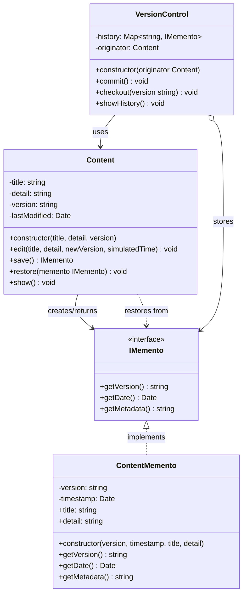
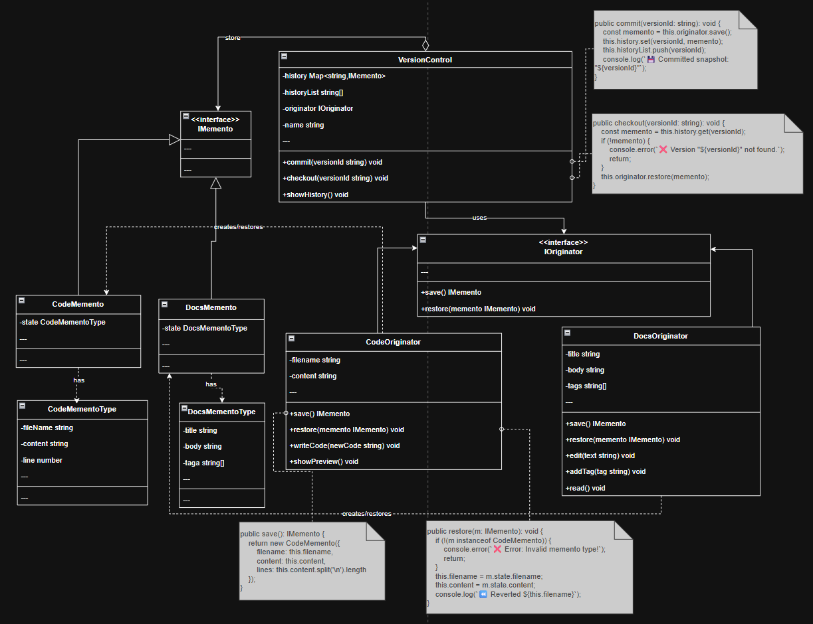

# Memento Pattern - Version Control System



## Memento Component
- **Memento Interface**: `IMemento`
- **Concrete Memento**: `ContentMemento`
- **Originator**: `Content`
- **Caretaker**: `VersionControl`

## Part of code is crucial

```ts
public save(): IMemento {
        return new ContentMemento(
            this.version,
            this.lastModified, // เก็บเวลาแก้ไขล่าสุด ไม่ใช่เวลาปัจจุบัน
            this.title,
            this.detail
        );
    }
```
```ts
 public restore(memento: IMemento): void {
        // เช็คว่าเป็น Memento ของ Content จริงไหม
        if (!(memento instanceof ContentMemento)) {
            console.error("❌ Error: Invalid memento type.");
            return;
        }

        this.title = memento.title;
        this.detail = memento.detail;
        this.version = memento.getVersion();
        this.lastModified = memento.getDate();

        console.log(`⏪ Restored to: [${this.version}] (Modified: ${this.lastModified.toLocaleTimeString()})`);
    }
```
```ts
// method edit: รับเวลา simulatedTime ได้ เพื่อแก้ปัญหา Demo เวลาเท่ากัน
    public edit(title: string, detail: string, newVersion: string, simulatedTime?: Date): void {
        this.title = title;
        this.detail = detail;
        this.version = newVersion;

        // 🔥 Update เวลาเฉพาะตอน Edit เท่านั้น
        this.lastModified = simulatedTime || new Date();

        console.log(`📝 Edited Content: [${this.version}] "${this.title}"`);
    }
```

```ts
public commit(): void {
        const snapshot = this.originator.save();

        this.history.set(snapshot.getVersion(), snapshot);

        console.log(`💾 Committed: [${snapshot.getVersion()}]`);
    }

    public checkout(version: string): void {
        const snapshot = this.history.get(version);
        if (!snapshot) {
            console.error(`❌ Checkout Failed: Version "${version}" not found.`);
            return;
        }
        this.originator.restore(snapshot);
    }
```

## ใช้ Caretaker ในการจัดการ history ของ Memento ที่ถูกสร้างจาก Originator


## 🎯 Key Concepts

### **Memento Pattern Benefits:**
1. **Encapsulation** - Internal state ถูกเก็บใน Memento โดยไม่เปิดเผย implementation
2. **Undo/Redo** - สามารถย้อนกลับไปยัง state ก่อนหน้าได้
3. **Separation of Concerns** - Caretaker ไม่รู้รายละเอียดภายใน Originator
4. **Type Safety** - ใช้ interface เพื่อซ่อน concrete implementation

### **Critical Points:**
- ✅ **Memento** ห้าม Caretaker แก้ไขข้อมูลโดยตรง (readonly, private)
- ✅ **Originator** เป็นคนเดียวที่เข้าถึง state ภายใน Memento ได้
- ✅ **Caretaker** เก็บ Memento เป็น collection (Map, Array) เท่านั้น
- ✅ **Interface Segregation** - Caretaker เห็นแค่ narrow interface (IMemento)

## Planning in the Future
- เพิ่ม feature **Branch** และ **Merge** (Git-like workflow)
- เพิ่ม **Compression** สำหรับ Memento ที่เก่ามาก
- เพิ่ม **Diff Viewer** เพื่อเปรียบเทียบระหว่าง versions
- รองรับ **Concurrent Editing** (Operational Transformation)

### 1️⃣ **MEMENTO - Encapsulate State**
```typescript
// Memento Interface (Wide Interface for Originator)
interface IMemento {
    getVersion(): string;
    getDate(): Date;
    getMetadata(): string;
}

// Concrete Memento - Encapsulates Originator's internal state
class ContentMemento implements IMemento {
    constructor(
        private version: string,
        private timestamp: Date,
        public readonly title: string,   // Originator's state
        public readonly detail: string   // Originator's state
    ) { }
    
    getVersion(): string { return this.version; }
    getDate(): Date { return this.timestamp; }
    getMetadata(): string { return `${this.title}`; }
}
```

### 2️⃣ **ORIGINATOR - Create & Restore Snapshot**
```typescript
class Content {
    private title: string;
    private detail: string;
    private version: string;
    private lastModified: Date;

    // Create Memento (Snapshot) - returns narrow interface
    public save(): IMemento {
        return new ContentMemento(
            this.version,
            this.lastModified,
            this.title,
            this.detail
        );
    }

    // Restore from Memento
    public restore(memento: IMemento): void {
        if (!(memento instanceof ContentMemento)) {
            console.error("❌ Invalid memento type.");
            return;
        }
        
        this.title = memento.title;
        this.detail = memento.detail;
        this.version = memento.getVersion();
        this.lastModified = memento.getDate();
    }
}
```

### 3️⃣ **CARETAKER - Manage History**
```typescript
class VersionControl {
    private history: Map<string, IMemento> = new Map();
    private originator: Content;

    // Save current state
    public commit(): void {
        const snapshot = this.originator.save();
        this.history.set(snapshot.getVersion(), snapshot);
    }

    // Restore to specific version
    public checkout(version: string): void {
        const snapshot = this.history.get(version);
        if (!snapshot) {
            console.error(`❌ Version "${version}" not found.`);
            return;
        }
        this.originator.restore(snapshot);
    }
}

// Usage - Version Control System
const article = new Content("Design Patterns", "Intro...", "v1.0");
const git = new VersionControl(article);

git.commit();                                          // Save v1.0
article.edit("Updated Title", "New content", "v2.0");  // Edit
git.commit();                                          // Save v2.0
git.checkout("v1.0");                                  // Restore to v1.0
```


