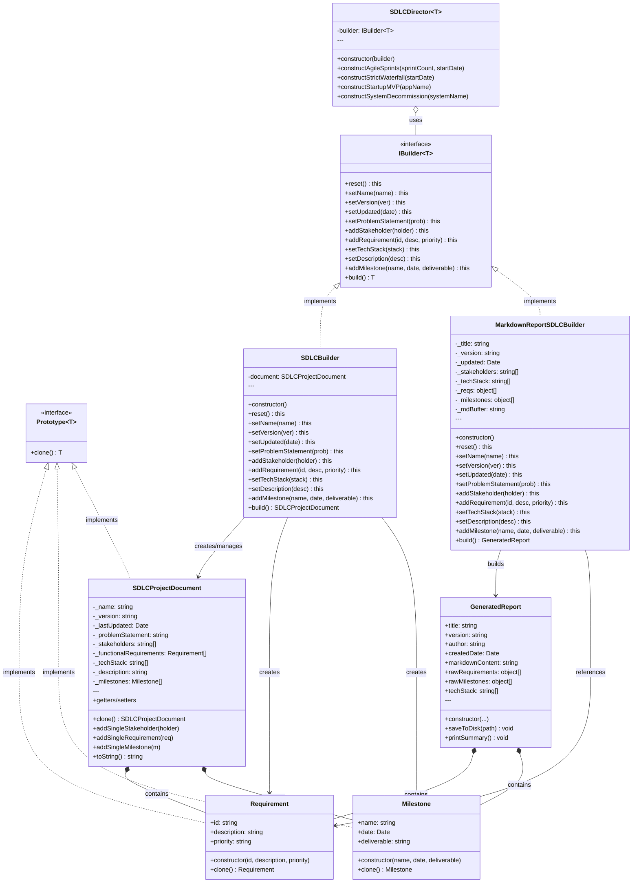

# SDLC Project Document - Prototype + Builder Pattern

```mermaid
classDiagram
    %% ============== PROTOTYPE PATTERN ==============
    class Prototype~T~ {
        <<interface>>
        +clone() T
    }

    class Requirement {
        +id: string
        +description: string
        +priority: string
        +constructor(id, description, priority)
        +clone() Requirement
    }

    class Milestone {
        +name: string
        +date: Date
        +deliverable: string
        +constructor(name, date, deliverable)
        +clone() Milestone
    }

    class SDLCProjectDocument {
        -_name: string
        -_version: string
        -_lastUpdated: Date
        -_problemStatement: string
        -_stakeholders: string[]
        -_functionalRequirements: Requirement[]
        -_techStack: string[]
        -_description: string
        -_milestones: Milestone[]
        ---
        +clone() SDLCProjectDocument
        +addSingleStakeholder(holder)
        +addSingleRequirement(req)
        +addSingleMilestone(m)
        +toString() string
        +getters/setters
    }

    %% ============== REPORT PRODUCT ==============
    class GeneratedReport {
        +title: string
        +version: string
        +author: string
        +createdDate: Date
        +markdownContent: string
        +rawRequirements: object[]
        +rawMilestones: object[]
        +techStack: string[]
        ---
        +constructor(...)
        +saveToDisk(path) void
        +printSummary() void
    }

    %% ============== BUILDER PATTERN ==============
    class IBuilder~T~ {
        <<interface>>
        +reset() this
        +setName(name) this
        +setVersion(ver) this
        +setUpdated(date) this
        +setProblemStatement(prob) this
        +addStakeholder(holder) this
        +addRequirement(id, desc, priority) this
        +setTechStack(stack) this
        +setDescription(desc) this
        +addMilestone(name, date, deliverable) this
        +build() T
    }

    class SDLCBuilder {
        -document: SDLCProjectDocument
        ---
        +constructor()
        +reset() this
        +setName(name) this
        +setVersion(ver) this
        +setUpdated(date) this
        +setProblemStatement(prob) this
        +addStakeholder(holder) this
        +addRequirement(id, desc, priority) this
        +setTechStack(stack) this
        +setDescription(desc) this
        +addMilestone(name, date, deliverable) this
        +build() SDLCProjectDocument
    }

    class MarkdownReportSDLCBuilder {
        -_title: string
        -_version: string
        -_updated: Date
        -_stakeholders: string[]
        -_techStack: string[]
        -_reqs: object[]
        -_milestones: object[]
        -_mdBuffer: string
        ---
        +constructor()
        +reset() this
        +setName(name) this
        +setVersion(ver) this
        +setUpdated(date) this
        +setProblemStatement(prob) this
        +addStakeholder(holder) this
        +addRequirement(id, desc, priority) this
        +setTechStack(stack) this
        +setDescription(desc) this
        +addMilestone(name, date, deliverable) this
        +build() GeneratedReport
    }

    %% ============== DIRECTOR PATTERN ==============
    class SDLCDirector~T~ {
        -builder: IBuilder~T~
        ---
        +constructor(builder)
        +constructAgileSprints(sprintCount, startDate)
        +constructStrictWaterfall(startDate)
        +constructStartupMVP(appName)
        +constructSystemDecommission(systemName)
    }

    %% ============== RELATIONSHIPS ==============
    Prototype~T~ <|.. Requirement : implements
    Prototype~T~ <|.. Milestone : implements
    Prototype~T~ <|.. SDLCProjectDocument : implements

    SDLCProjectDocument *-- Requirement : contains
    SDLCProjectDocument *-- Milestone : contains

    IBuilder~T~ <|.. SDLCBuilder : implements
    IBuilder~T~ <|.. MarkdownReportSDLCBuilder : implements

    SDLCBuilder --> SDLCProjectDocument : creates/manages
    SDLCBuilder --> Requirement : creates
    SDLCBuilder --> Milestone : creates

    MarkdownReportSDLCBuilder --> GeneratedReport : builds
    MarkdownReportSDLCBuilder --> Requirement : references

    GeneratedReport *-- Requirement : contains
    GeneratedReport *-- Milestone : contains

    SDLCDirector~T~ o-- IBuilder~T~ : uses
```
