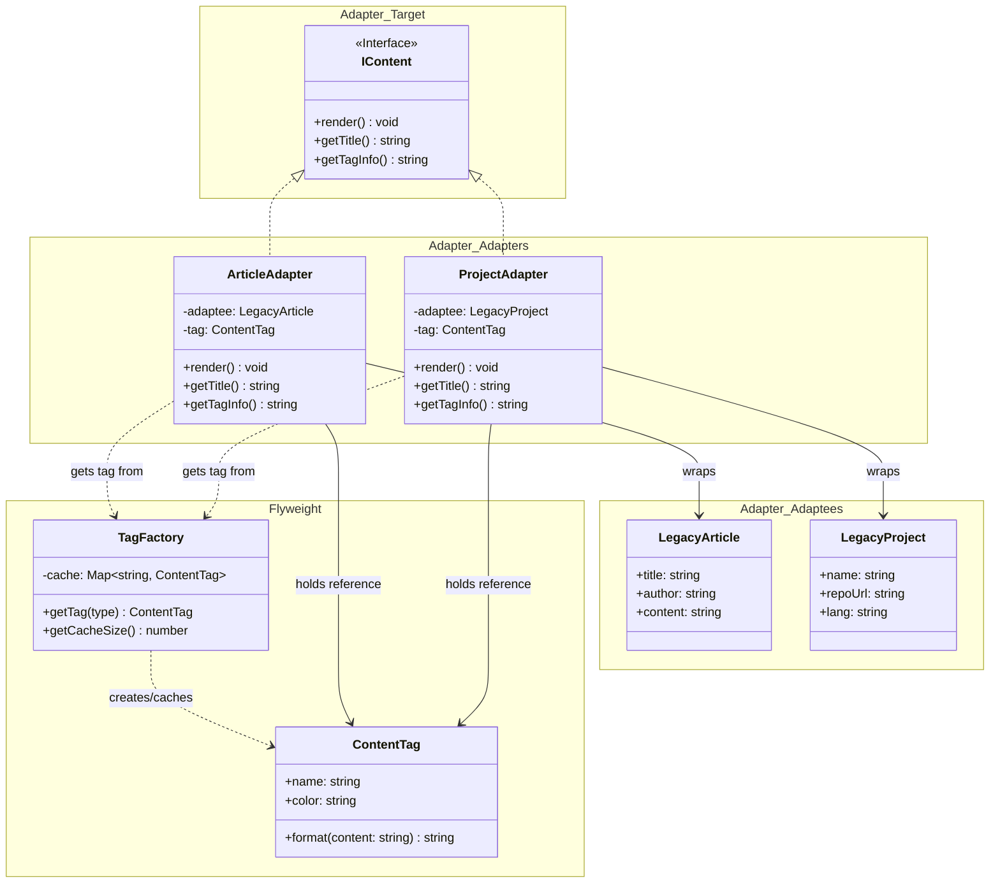

## Part of Code is Crucial

**Flyweight - ContentTag methods for Adapter usage:**
```ts
public format(content: string): string {
    return `[${this.color}] ${this.name}: ${content}`;
}

// public decorateContent(title: string, extra?: string): string {
//     const base = `[${this.color}] ${this.name}: ${title}`;
//     return extra ? `${base} (${extra})` : base;
// }
```

**Adapter - Using Flyweight's format method:**
```ts
public render(): void {
    console.log(this.tag.format(`${this.adaptee.title} (by ${this.adaptee.author})`));
}
```

**Factory - Cache Management:**
```ts
public getTag(type: 'article' | 'project'): ContentTag {
    if (!this.cache.has(type)) {
        const color = type === 'article' ? 'Green' : 'Blue';
        const newTag = new ContentTag(type, color);
        this.cache.set(type, newTag);
    }
    return this.cache.get(type)!;
}
```

## Flyweight + Adapter Component
- **Flyweight**: `ContentTag`
- **Flyweight Factory**: `TagFactory`
- **Adapter Target**: `IContent`
- **Adapter Adaptees**: `LegacyArticle`, `LegacyProject`
- **Adapter Adapters**: `ArticleAdapter`, `ProjectAdapter`
- **Client**: `User`


